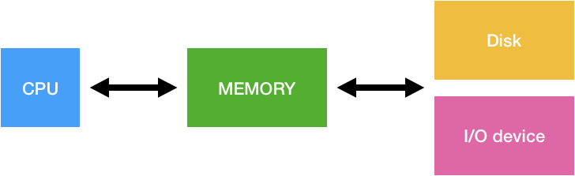

# Introduction oto Operating System

## 1. 운영체제란?
컴퓨터 하드웨어 바로 위에 설치되어 사용자 및 다른 소프트웨어와 하드웨어를 연결하는 소프트웨어 계층

- 좁은 의미의 운영체제
  - 운영체제의 핵심 부분으로 **메모리에 상주하는 부분**
  - 커널을 말하기도 한다.
- 넓은 의미의 운영체제
  - 커널 뿐 아니라 주변 시스템 유틸리티를 포함

## 2. 운영체제의 목적
컴퓨터 시스템의 **자원을 효율적으로 관리**하는 것이 주된 목적이다.

- 프로세서, 기억장치, 입출력 장치 등의 효율적 관리
  - 사용자간의 형평성 있는 자원 분배
  - 주어진 자원으로 최대한 성능을 내도록 관리
- 사용자 및 운영체제 보호
- 프로세스, 파일, 메시지 등을 관리
- 컴퓨터 **시스템을 편리하게 사용할 수 있는 환경 제공**
  - 사용자/프로그램들이 **각각 독자적 컴퓨터에서 수행되는 것 같이 동작**
  - 하드웨어를 직접 다루는 복잡한 부분을 운영체제가 대행

## 3. 운영체제의 분류

### 3.1. 동시 작업 가능 여부
- **단일 작업(single tasking)**
  - 한 번에 하나의 작업만 처리
  - 한 명령의 수행을 끝내기 전에 다른 명령을 수행시킬 수 없다.
- **다중 작업(multi tasking)**
  - 동시에 두 개 이상의 작업 처리
  - 한 명령의 수행이 끝나기 전에 다른 명령이나 프로그램을 수행할 수 있다.

### 3.2. 사용자의 수
- **단일 사용자(single user)**
  - MS-DOS, MS Windows
- **다중 사용자(multi user)**
  - UNIX, NT Server

### 3.3. 처리 방식
- **일괄 처리(batch processing)**
  - 작업 요청의 일저량을 모아서 한꺼번에 처리
  - 작업이 완전 종료될 때까지 기다려야 한다
  - Punch Card 처리 시스템
- **시분할(time sharing)**
  - 여러 작업을 수행할 때 컴퓨터 처리 능력을 **일정한 시간 단위로 분할**하여 사용
  - 일괄 처리 시스템에 비해 **짧은 응답 시간**을 가진다. (UNIX)
  - interactive한 방식 (키보드를 두들겼을 때 바로 화면에 결과가 나오는 것)
- **실시간(Realtime OS)**
  - **정해진 시간 안**에 어떤 일이 **반드시 종료됨이 보장**되어야 하는 실시간 시스템을 위한 OS
  - 원자로/공장 제어, 미사일 제어, 반도체 장비, 로봇 제어 등
  - **Hard realtime system**(경성 실시간 시스템)
  - **Soft realtime system**(연성 실시간 시스템)

# 4. 운영체제 기본 용어
- **Multitasking**
  - 여러 개의 프로그램을 동시에 실행하는 것
  - 매우 짧은 시간으로 각각 프로그램을 실행시켜 동시에 실행하는 것 처럼 보이게 함
- **Multiprogramming**
  - 메모리 위에 동시에 여러 프로그램들이 올라가 있는 것
  - 동시 실행을 메모리 측면을 강조한 것
- **Time sharing**
  - 시간을 분할하는 것
  - CPU 측면을 강조한 것
- **Multiprocess**
  - 여러 개의 프로그램이 동시에 실행하는 것
- **Multiprocessor**
  - 하나의 컴퓨터에 여러 CPU가 존재하는 것

# 5. 운영체제의 구조

- **CPU**
  - 어떤 프로그램에 CPU 자원을 줄 것인가? (**CPU 스케쥴링**)
- **Memory**
  - 한정된 메모리를 어떻게 쪼개어 사용할 것인가? (**메모리 관리**)
- **Disk**
  - 디스크에 파일을 어떻게 보관할 것인가? (**파일 관리**)
- **I/O device**
  - 각기 다른 입출력장치와 컴퓨터 간에 어떻게 정보를 주고 받을 것인가? (**입출력 관리**)
  - **Interrupt** 사용 (I/O와 CPU가 별도로 작업을 하고 I/O에서 작업이 끝나면 CPU에 인터럽트 신호를 보냄)

# 6. 그 외
- 프로세스 관리
  - 프로세스 생성과 삭제
  - 자원 할당 및 반환
  - 프로세스 간 협력
- 보호 시스템
- 네트워킹
- 명령어 해석기 (CLI)