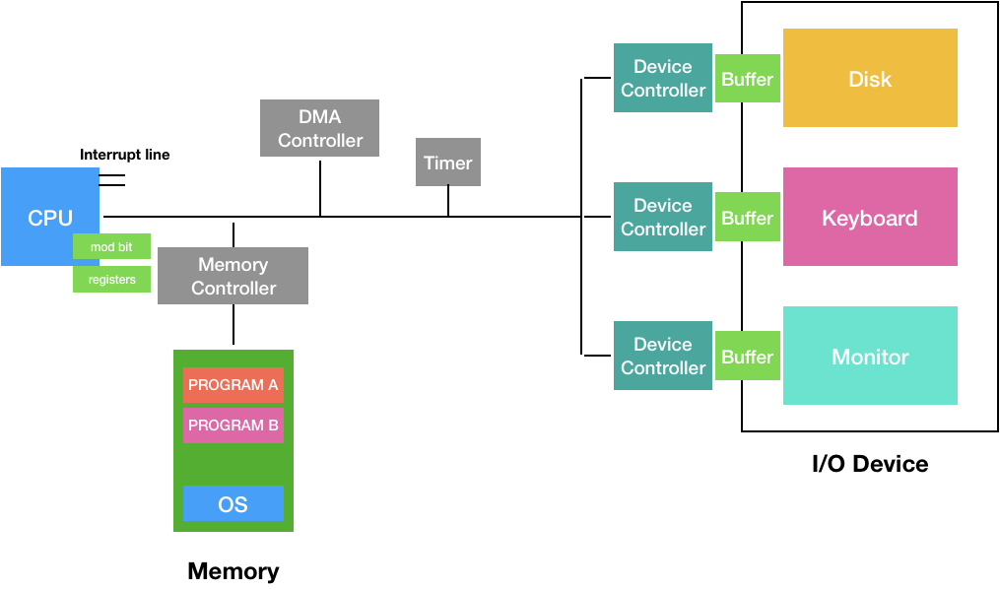
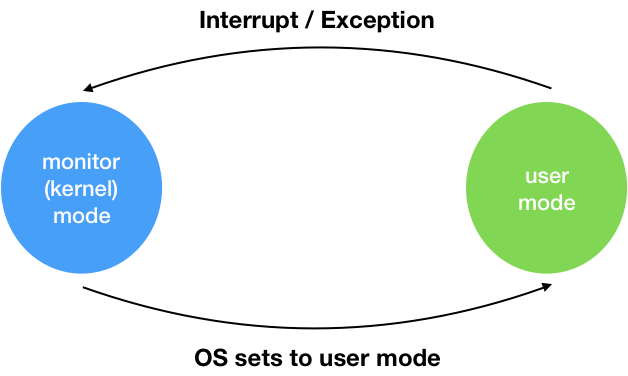
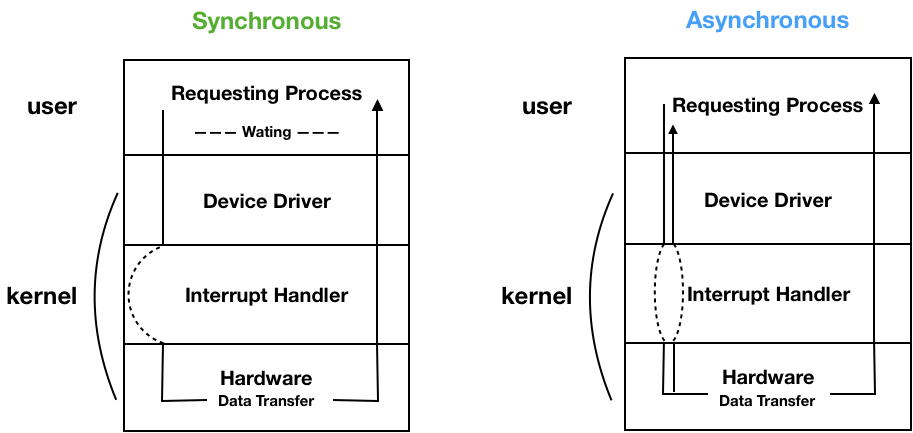
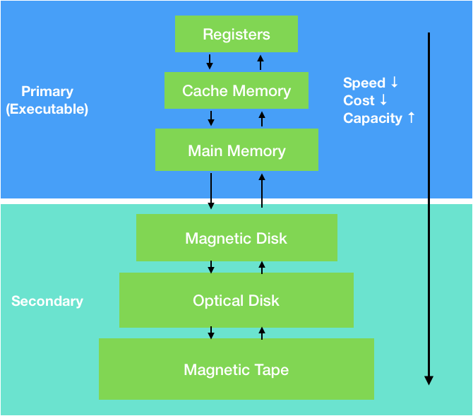
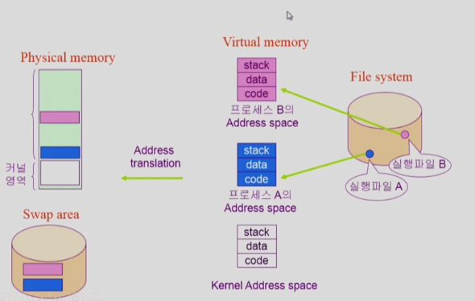
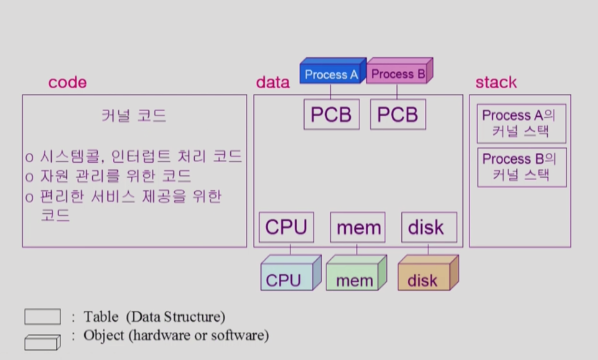

# System Structure & Program Execution

# 컴퓨터 시스템 구조

- **CPU**
  - Memoery에서 Instruction을 읽어서 명령을 수행
- **Register**
  - CPU 내에 존재하는 작은 저장 공간
  - 메모리보다 속도가 빠르다.
- **Mode bit**
  - CPU 내에 존재
  - CPU를 OS가 가지고 있는지 사용자 프로그램이 가지고 있는지 구분해줌
- **Interrupt Line**
  - CPU는 항상 Memory하고만 일을 하므로 I/O 작업에 대해서는 알지 못함
  - 어떤 프로그램을 동작하다가 입력을 받아야 하는 경우 I/O 입력을 받아야 한다. 이때 CPU가 Device Controller에 일을 시킨다. (명령만 함)
  - **I/O Device에서 동작이 끝나면 CPU로 Interrupt를 보내** 작업이 완료 됨을 알림
- **Timer**
  - 특정 프로그램이 CPU를 독점하는 것을 방지
  - CPU는 Timer에 할당된 시간동안 작업을 할 수 있다. (시간이 지나면 다른 프로그램으로 제어권을 넘겨준다)
  - Timer 시간이 다 되면 **Timer Interrupt**를 보낸다.
- **device controller**
  - I/O Device의 내부 동작을 하는 작은 CPU 역할을 한다.
  - CPU가 직접 I/O Device를 제어하지 않는다.
- **buffer**
  - device controller 작업을 위한 공간

# 1. Mode bit

사용자 프로그램의 잘못된 수행으로 다른 프로그램 및 운영체제에 피해가 가지 않도록 하기 위한 보호 장치

Mode bit을 통해 하드웨어적으로 두 가지 모드의 operation 지원
- 1: **사용자 모드** (사용자 프로그램 수행)
- 0: **모니터 모드** = **커널 모드** = **시스템 모드** (OS 코드 수행)

- 보안을 해칠 수 있는 **중요한 명령어**는 **모니터 모드에서만 수행이 가능**한 **특권명령**으로 규정한다.
- **Interrupt**나 **Exception** 발생시 하드웨어가 **mode bit을 0**으로 바꾼다.
- **사용자 프로그램에게 CPU를 넘기기 전**에 **mdoe bit을 1**로 셋팅

# 2. Timer

- 정해진 시간이 흐른 뒤 운영체제에게 제어권이 넘어가도록 Interrupt 발생
- Timer는 매 클럭 틱 때마다 1씩 감소
- Timer 값이 0이 되면 Timer Interrupt 발생
- **CPU를 특정 프로그램이 독점하는 것으로부터 보호**
- Timer는 **time sharing을 구현**하기 위해 널리 이용
- Timer는 현재 시간을 계산하기 위해서도 사용

# 3. Device Controller

- I/O Device Controller
  - 해당 **I/O 장치유형을 관리하는 일종의 작은 CPU**
  - 제어 정보를 위해 **control register**(어떤 명령을 처리할 것인지 출력 or 입력 등), **status register**를 가짐
  - logcal buffer를 가짐 (일종의 data register)
- I/O는 **실제 device**와 **local buffer 사이**에서 일어난다.
- Device Controller는 I/O가 끝났을 경우 Interrupt로 CPU에 사실을 알린다.

## Device Driver (장치 구동기)
OS 코드 중 각 장치별 처리루틴 -> Software

## Device Controller (장치 제어기)
각 장치를 통제하는 일종의 작은 CPU -> Hardware

# 4. DMA (Direct Memory Access)
- 빠른 입출력 장치를 메모리에 가까운 속도로 처리하기 위해서 사용
- 메모리를 접근할 수 있는게 CPU뿐이었지만, DMA에서도 Memory에 접근할 수 있다.
- **Device Controller가 Device의 Buffer Storage 내용을 메모리에 Block 단위로 전송**한다. (⭐️ 바이트 단위가 아니라 **block 단위로 인터럽트 발생**)
- 특정 메모리 영역을 CPU와 DMA가 동시에 접근하게 될 경우 문제가 생길 수 있으므로 **Memory Controller에서 제어**

CPU는 Memory, I/O의 Local Buffer 접근이 가능하다. CPU는 I/O Controller에서 Interrupt를 보내면 Local Buffer에 쌓인 데이터를 Memory로 옮겨야 한다.

**I/O 장치가 Interrupt를 너무 많이 발생**하므로 이를 처리하기 위해 **CPU가 느려지는 문제**가 있다. 이를 해결하기 위해 **DMA가 I/O의 Local Buffer에 존재하는 데이터들을 Memory에 직접 복사**한다. 이 작업이 모두 끝나면 **DMA는 CPU에 Interrupt를 한 번**만 건다.

# 5. 입출력(I/O) 수행

- 모든 입출력 명령은 **특권 명령**이다. (**Mode bit 0 -> monitor**)
- 사용자 프로그램은 I/O를 어떻게 하는가?
  - **System call** (사용자 프로그램이 OS에게 I/O 요청)
  - **trap**을 사용하여 **Interrupt 벡터의 특정 위치로 이동**
  - 제어권이 **Interrupt 벡터가 가리키는 Interrupt 서비스 루틴으로 이동**
  - 올바른 I/O 요청인지 확인 후 수행
  - **I/O 완료 시** 제어권을 **System call 다음 명령으로 옮긴다.**

## I/O 수행 과정 ⭐️⭐️
1. 사용자 프로그램이 I/O를 요청하기 위해 **OS에 System call** (SW Interrupt - trap)
2. I/O에서 작업이 완료되면 CPU에 Interrupt를 보냄 (HW Interrupt)

# 6. Interrupt

**Interrupt 당한 시점의 레지스터**와 **Program counter**를 **save** 한 후 **CPU의 제어를 Interrupt 처리 루틴에 넘긴다.**

## Interrupt의 넓은 의미 ⭐️
- **Interrupt** (하드웨어 Interrupt): 하드웨어가 발생시킨 Interrupt
- **Trap** (소프트웨어 Interrupt)
  - Exception: 프로그램이 오류를 범한 경우
  - System call: 프로그램이 커널 함수를 호출하는 경우

## Interrupt 관련 용어
- **Interrupt 벡터**
  - 해당 Interrupt의 **처리 루틴 주소**를 가지고 있다.
- **Interrupt 처리 루틴** (Interrupt Service Routine, Interrupt 핸들러)
  - 해당 **Interrupt를 처리하는 커널 함수**

⭐️ 현대의 운영체제는 Interrupt에 의해 구동된다. ⭐

# 7. 동기식 입출력 VS 비동기식 입출력

## 동기식 입출력 (Synchronous I/O)
- I/O 요청 후 **입출력 작업이 완료된 후**에 **제어가 사용자 프로그램에 넘어간다.**
- 구현 방법 1
  - I/O가 끝날 때까지 CPU를 낭비시킴
  - 매 시점 하나의 I/O만 일어날 수 있음
- 구현 방법 2 (I/O가 걸리면 다른 프로그램에게 CPU 제어를 줌)
  - I/O가 완료될 때까지 해당 프로그램에게서 CPU를 빼앗음
  - I/O 처리를 기다리는 줄에 그 프로그램을 줄 세움
  - I/O 요청을 하는 다른 프로그램에게 CPU를 줌
  - 여러개의 I/O 요청을 하여 동시에 여러개의 I/O를 처리할 수 있도록 함

## 비동기식 입출력 (Asynchronous I/O)
- I/O가 시작된 후 입출력 **작업이 끝나기를 기다리지 않고 제어가 사용자 프로그램에 즉시 넘어간다.**
- I/O 요청을 넘기고 I/O작업 끝나는 여부 상관없이 **바로 다음 작업을 수행**

⭐️ 두 경우 모두 **I/O의 완료는 인트럽트로 알려준다.** ⭐️

# 8. 저장장치 계층 구조

- **Primary**: CPU가 **직접 접근해서 처리 가능** (**Byte 단위**로 접근)
- **Secondary**: CPU가 **직접 접근이 가능하지 않는것** (HDD는 **Sector** 단위)

# 9. 프로그램 실행

1. File System에 존재하는 실행 파일을 **Virtual Memory에 load**
2. Virtual Memory의 주소를 **Physical Memory 주소에 매핑** (한번에 물리 메모리에 올리지 않고 **필요한 메모리만 올린다.** **불필요한 메모리**는 Disk에 존재하는 **Swap Area에 둠**)

- **PCB(Process Control Block)**: 프로그램을 관리하기 위한 자료구조

# 10. 함수

## 사용자 정의 함수
- 자신의 프로그램에서 정의한 함수

## 라이브러리 함수
- 자신의 프로그램에서 정의하지 않고 갖다 쓴 함수
- 자신의 프로그램의 실행 파일에 포함되어 있다. (**프로세스의 code 영역**)

## 커널 함수
- 운영체제 프로그램의 함수
- **커널 함수 호출 = System Call** (사용자 프로그램에서는 커널에 접근할 수 없기 때문에 System call을 통해서만 접근)
- 커널 메모리의 code 영역에 존재

# 11. 프로그램의 실행
user mode -> system call -> kernel mode -> kernel function 종료 -> user mode -> system call -> kernel mode -> ... 계속 반복된다.