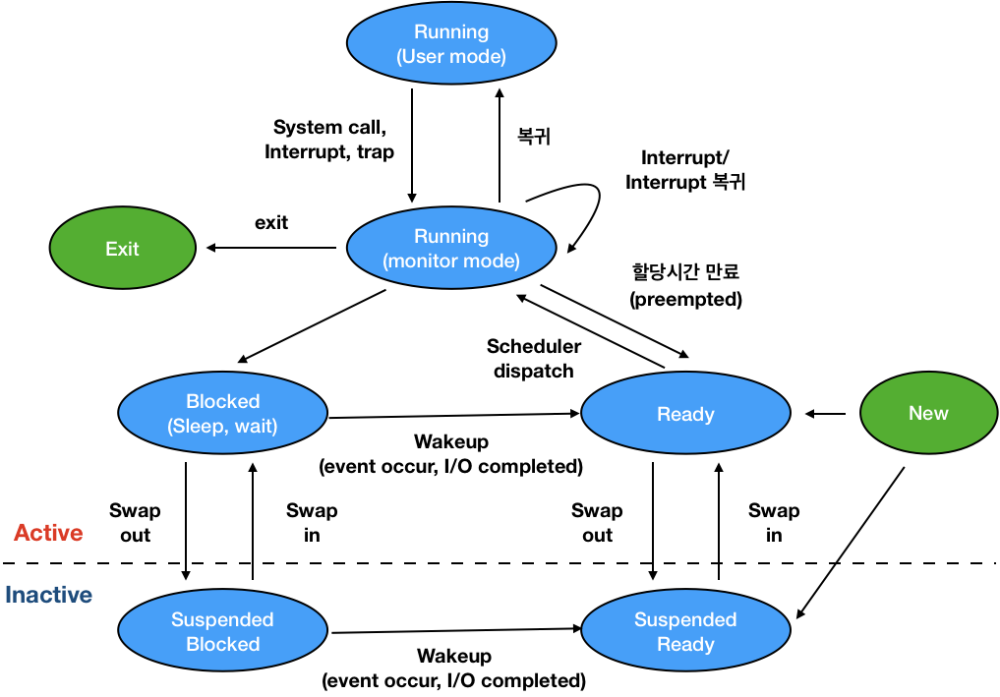

# Process

# 1. 프로세스 개념

프로세스는 **실행중인 프로그램**을 뜻한다.

## 프로세스 문맥 (Context) - 특정 시점에 어디까지 실행했는지 정보를 지님

1. **code**, **data**, **stack** 메모리 형성
2. PC가 코드 부분을 가리킴
3. code에서 **Instruction을 읽어 ALU를 거쳐 연산 후 저장**

현재 시점의 문맥을 나타내기 위해서는 **PC가 가리키는 곳**, **메모리에 어떤 내용**을 담고 있는지, **변수의 값**은 무엇인지, **레지스터에 어떤 값**을 넣어놨고, **어떤 인스트럭션까지 실행**했는가를 가지고 있는게 `프로세스 문맥`이다.  

**멀티 스레딩 환경** 때문에 프로세스 문맥을 가지고 있어야 한다.

⭐️️️️⭐️
- CPU **수행 상태**를 나타내는 **하드웨어 문맥** (레지스터가 현재 어떤 값을 가지고 있는지)
  - **Program Counter**
  - 각종 **Register**
- 프로세스의 **주소 공간**
  - **code**, **data**, **stack**
- 프로세스 관련 **커널 자료 구조**
  - **PCB(Process Control Block)**
  - **Kernel Stack** (프로세스마다의 정보(**PCB**)를 Kernel Stack에 가지고 있음)

# 2. 프로세스의 상태 (Process State)

### CPU 입장에서의 상태

### Running을 두 가지 상태로 구분

## Running
- CPU를 잡고 instruction을 수행중인 상태

## Ready
- 프로그램을 실행하는데 필요한 **최소한의 정보**만 메모리에 올라와 있고 **CPU의 제어권 획득만 기다리는 상태**
- Ready 상태를 번갈아 가면서 **Time sharing 구현**

## Blocked(wait, sleep)
- CPU를 줘도 당장 **instruction을 수행할 수 없는 상태**
- Process 자신이 **요청한 event(예: I/O)가 즉시 만족되지 않아 기다리는 상태**
- 예) 디스크에서 file을 읽어와야 하는 경우
- ⭐️ **자신이 요청한 event가 만족**되면 **Ready**

## Suspended (stopped)
- `Mid-Term Scheduler`로 인해 새로운 상태가 생김
- 외부적인 이유(`Mid-Term Scheduler`)로 **프로세스의 수행이 정지**된 상태
- **프로세스**는 통째로 **디스크에 swap out** 된다.
- 예) 사용자가 프로그램을 일시 정지시킨 경우 (break key)
  - 시스템이 여러 이유로 프로세스를 잠시 중단 (**메모리에 너무 많은 프로세스가 올라와 있을 때**)
- ⭐️ **외부에서 resume**해 주어야 **Active**

## New
- **프로세스가 생성중인 상태**

## Terminate
- **수행(execution)이 끝난 상태**
- 프로세스를 마무리하고 정리하는 작업

Queue는 운영체제 **커널의 Data 영역**에 자료구조로 Queue를 만들고 Process 상태를 바꿔가며 Ready 상태 있는 프로세스에게 CPU를 주고 안주고 함

# 3. PCB (Process Control Block)

- ⭐️ PCB는 **Kernel Memory Stack 영역**에 저장
- 운영체제가 **각 프로세스를 관리**하기 위해 **프로세스당 유지하는 정보**
- 정보들을 구조체로 관리
- **OS가 관리상 사용**하는 정보 - 1
  - **Process State**, **Process ID**
  - **Scheduling Information**, **Priority**
- **CPU 수행 관련** 하드웨어 값(Process의 문맥을 관리를 위한 정보) - 2
  - **Program Counter**, **Registers**
- **메모리 관련**(메모리 관련 문맥) - 3
  - **Code**, **Data**, **Stack의 위치 정보**
- **파일 관련**(리소스 관련 정보) - 4
  - **Open file descriptors**

# 4. 문맥 교환 (Context Switching)

- ⭐️ CPU를 **한 프로세스**에서 **다른 프로세스로 넘겨주는 과정**
- CPU가 다른 프로세스에게 넘어갈 때 운영체제는 다음을 수행
  - **CPU를 내어주는 프로세스의 상태**를 그 **프로세스의 PCB에 저장**
  - **CPU를 새롭게 얻는 프로세스의 상태**를 **PCB에서 읽어옴**

## 🚨 System call이나 Interrupt 발생시 반드시 Context Switching이 발생하는 것은 아니다.

- CPU 수행 정보 등 **Context의 일부를 PCB에 save**해야 하지만 **부담이 크지는 않다.**
- 사용자 프로세스 A를 작동하다가 Kernel Mode 실행 후 다시 프로세스 A로 돌아왔기 때문에 Context Switching이 아니다.

- Timer Interrupt는 다른 프로세스에게 CPU를 넘긴다는 의미로 사용하는 Interrupt
- **다른 프로세스에게 CPU 작업을 넘기므로** `Context Switching`이다.
- **문맥 교환 시 cache memory flush** (cache memory 모두 지움)가 발생하기 때문에 **오버헤드가 크다.**

# 5. 프로세스 스케쥴링을 위한 큐

## Job Queue
- **현재 시스템 내에 있는 모든 프로세스의 집합**
- Reday Queue + Device Queue

## Ready Queue
- **현재 메모리 내**에 있으면서 CPU를 잡아서 **실행되기를 기다리는 프로세스의 집합**

## Device Queues
- **I/O Device의 처리를 기다리는 프로세스의 집합**

**프로세스들은 각 큐들을 오가며 수행한다.**

# 6. 스케줄러 (Scheduler)

## Long-Term Scheduler (장기 스케줄러 or job scheduler) - 주는 역할
- **메모리 할당 관련** 스케줄러
- **시작 프로세스** 중 **어떤 것을 ready queue로 보낼지** 결정
- 프로세스에 **memory**(및 각종 자원)을 주는 문제
- **degree of Multiprogramming** (동시에 메모리에 올라가는 **프로세스의 수**) 제어
- time sharing system에는 **보통 장기 스케줄러가 없다.** (무조건 ready)

## Short-Term Scheduler (단기 스케줄러 or CPU Scheduler)
- **CPU 제어권 할당 관련** 스케줄러
- **어떤 프로세스**를 다음번에 **running 시킬지 결정**
- 프로세스에 **CPU**를 주는 문제
- 충분히 빨라야 한다. (millisecond 단위)

## Medium-Term Scheduler (중기 스케줄러 or Swapper) - 뺏는 역할
- **여유 공간 마련을 위해 프로세스를 통째로 메모리에서 디스크로 쫓아냄**
- **메모리에 너무 많은 프로그램이 올라온 경우** 메모리에서 제거
- 프로세스에게서 **memory를 뺏는 문제**
- **degree of Multiprogramming 제어**

# 7. 스레드 (Thread)

- `스레드`(or `lightweight process`)는 CPU를 이용하는 기본 단위이다.
- 전동적인 개념의 `Heavyweight Process`는 **하나의 Thread**를 가지고 있는 **task**로 볼 수 있다.
- 다중 스레드로 구성된 Task 구조에서는 **하나의 서버 스레드가 blocked (waiting) 상태**인 동안에도 **동일한 Task 내의 다른 스레드가 실행(running)되어 빠른 처리**를 할 수 있다.
- 동일한 일을 수행하는 **다중 스레드가 협력**하여 **높은 처리율 (throughput)**과 **성능 향상**을 얻을 수 있다.
- 스레드를 사용하면 **병렬성을 높일 수 있다.** (행렬 곱 같은 경우)

## 스레드의 구성
- **Program Counter (PC)**
- **Register Set**
- **Stack Space**

## 스레드가 동료 쓰레드와 공유하는 부분 (= task)
- **Code Section**
- **Data Section**
- **OS Resources**

## Single and Multithreaded Processes

## 스레드의 장점
- **반응성(Responsiveness)**: **하나의 작접이 block 되어도 다른 스레드가 동작**하여 사용자에게 빠른 반응성을 제공
  - ex) multi-threaded web: network가 blocked 되었을 경우 받아온 데이터를 rendering 하는 스레드가 동작하여 사용자에게 빠른 브라우징 환경 제공
- **자원 공유(Resource Sharing)**: n개의 스레드가 **프로세스의** `Code`, `Data`, `Resource`를 **공유**하여 자원 낭비 방지
- **경제성 (Economy)**
  - **process를 creating & CPU Swithcing하는 비용**보다 **thread를 creating & Swithcing 하는 비용**이 더 **적다.**
  - Solaris의 경우 overhead가 각각 30배, 5배 차이 난다고 한다.
- **멀티프로세서 환경에서의 이용**
  - 각 스레드는 **다른 프로세서에서 병렬적**으로 작동한다.

## 스레드의 구현 방법
- 운영체제 kernel의 도움을 받아 구현
  - **Thread가 여러개** 있다는 사실을 **OS 커널이 알고 있다.**
  - 하나의 스레드에서 **다른 스레드로 넘어가는 것**을 **커널이 CPU 스케줄링 하는 것 처럼 넘겨준다.**
  - Windows 95/98/NT
  - Solaris
  - Digital UNIX, Mach

- Library의 도움을 받아 구현
  - 프로세스 안에 **여러개의 Thread**가 있다는 것을 **OS 커널이 알지 못한다.**
  - **User Program이 스스로 Thread를 관리**하기 때문에 **구현상의 제약점**이 존재한다.
  - **Kernel이 봤을 때는 일반적인 프로세스로 보인다.**

- Real-time threads