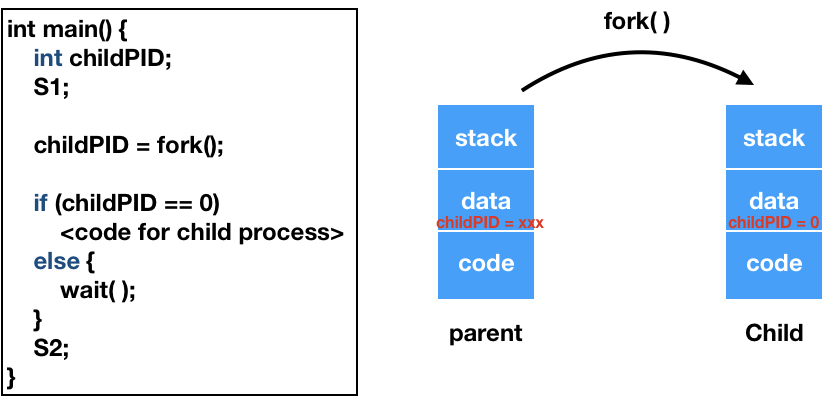
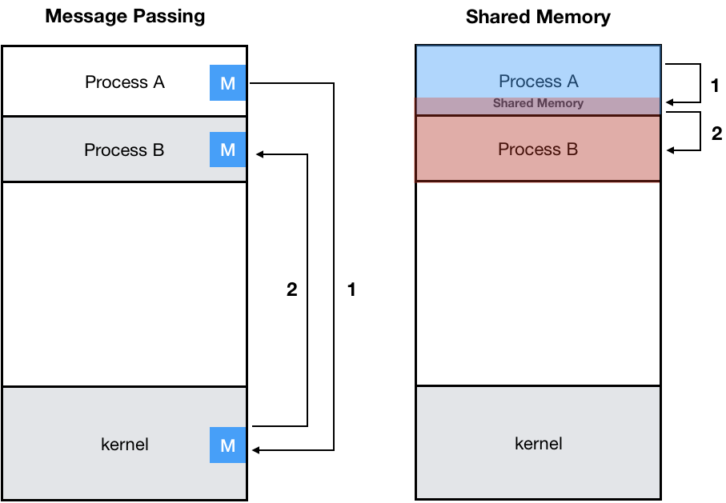
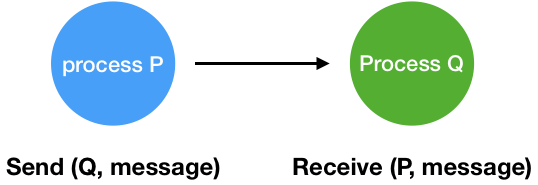
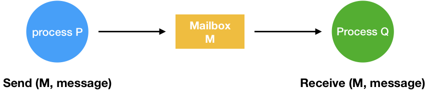

# Process Management

# 1. 프로세스 생성

- **부모 프로세스**가 **자식 프로세스를 생성**
- 프로세스의 트리(**계층 구조**) 형성
- 프로세스는 **자원을 필요**로 한다.
  - **운영체제로부터 할당**
  - 부모와 **공유**
- **자원의 공유**
  - **부모와 자식**이 **모든 자원을 공유**하는 모델
  - **일부를 공유**하는 모델
  - **전혀 공유하지 않는** 모델
  - 효율적인 자원 공유
    - ⭐️ 가능한 **공유할 수 있는 데이터들은 공유**
    - ⭐️ **Copy On Write** (처음에는 데이터를 공유하다가 **자식과 부모가 달라지는 시점에 Copy**)
- **수행 (Execution)**
  - **부무와 자식이 공존**하며 수행되는 모델
  - **자식이 종료(terminate)될 때까지 부모가 기다리는(wait - blocked) 모델**
- **주소 공간 (Address Space)**
  - 자식은 **부모의 공간을 복사**함 (**binary and OS data**)
  - 자식은 **그 공간에 새로운 프로그램**을 올림
- 유닉스 예
  - `fork()` **시스템 콜**이 **새로운 프로세스 생성**
    - **부모 그대로 복사** (OS data except PID + binary)
    - **주소 공간 할당**
  - fork() 다음에 이어지는 `exec()` **시스템 콜**을 통해 **새로운 프로그램을 메모리에 올림**

# 2. 프로세스 종료

- 프로세스가 **마지막 명령을 수행한 후** 운영체제에게 이를 알림 (`exit`)
  - **자식이** 부모 프로세스에게 **output data를 보냄** (via `wait`)
  - 프로세스의 **각종 자원들이 운영체제에게 반납**
- **부모 프로세스**가 **자식의 수행을 종료** (`abort`)
  - 자식이 **할당 자원의 한계치를 넘어섬**
  - 자식에게 **할당된 작업이 더 이상 필요하지 않음**
  - **부모가 종료**(`exit`)하는 경우
    - 운영체제는 **부모 프로세스가 종료**하는 경우 **자식이 더 이상 수행되도록 두지 않는다.**
    - ⭐️ **단계적인 종료** (자식 먼저 죽고 단계적으로 부모로 올라옴)

# 3. fork() 시스템 콜

**process**는 `fork() 시스템 콜`에 의해서 **생성**된다. (새로운 주소 공간 생성)

```c
int main() {
    int pid;
    pid = fork();
    if (pid == 0) // child
      printf("\n Hello, I am child!\n");
    else if (pid > 0) // parent
      printf("\n Hello, I am parent!\n");
}
```

# 4. exec() 시스템 콜

**process**는 `exec() 시스템 콜`에 의해서 **다른 프로그램을 실행**시킬 수 있다. (새로운 프로그램으로 메모리를 대체)

```c
int main() {
    int pid;
    pid = fork();
    if (pid == 0) {// child
      printf("\n Hello, I am child!\n");
      execlp("/bin/data", "/bin/data", (char*)0);
    }
    else if (pid > 0) // parent
      printf("\n Hello, I am parent!\n");
}
```

# 5. wait() 시스템 콜

- 프로세스 A가 `wait()` 시스템 콜을 호출하면
  - 커널은 **child가 종료될 때까지** 프로세스 A를 `sleep`시킨다. (**block 상태**)
  - **Child process가 종료**되면 커널은 프로세스 A를 **깨운다**. (**ready 상태**)
  - ex) Command line system -> CLI 계산기 프로그램에서 입력을 받고 기다렸다가 연산이 끝나면 그 다음 명령을 받는 것



`wait()`는 **자식 프로세스가 종료될 때까지** wait한다.

# 6. exit() 시스템 콜

- 프로세스의 종료
  - **자발적 종료**
    - **마지막 statement 수행 후** `exit() 시스템 콜`을 통해 종료
    - 프로그램에 명시적으로 넣지 않아도 **main 함수가 리턴되는 위치**에 **컴파일러가 자동으로 넣어준다.**
  - **비자발적 종료**
    - **부모 프로세스**가 **자식 프로세스를 강제 종료** 시킴
      - **자식 프로세스가 한계치를 넘는 자원 요청**
      - **자식에게 할당된 작업이 더 이상 필요하지 않음**
    - 키보드로 `kill`, `break` 등을 입력한 경우
    - 부모가 종료하는 경우
      - ⭐️ 부모 프로세스가 종료하기 전에 **자식들이 먼저 종료**된다.

# 7. 프로세스 간 협력

## 독립적 프로세스 (Independent Process)
프로세스는 **각자의 주소 공간**을 가지고 수행되므로 원칙적으로 **하나의 프로세스는 다른 프로세스 수행에 영향을 미치지 못한다.**

## 협력 프로세스 (Cooperating Process)
프로세스 협력 메커니즘을 통해 **하나의 프로세스가 다른 프로세스의 수행에 영향을 미칠 수 있다.**

## 프로세스 간 협력 메커니즘(IPC: Interprocess Communication)


### 메시지를 전달하는 방법

#### message passing
`커널`을 통해 **메시지 전달**

#### Message System
프로세스 사이에 `공유 변수(shared variable)`를 **일체 사용하지 않고 통신**하는 시스템

#### Direct Communication
통신하려는 프로세스의 **이름을 명시적으로 표시**


#### Indirect Communication
`mailbox` 또는 `port`를 통해 메시지를 전달


**주소 공간을 공유**
1. **shared memory**: 서로 다른 프로세스 간에도 **일부 주소 공간을 공유**하게 하는 `shared memory` 메커니즘 (**커널한테** shared memory를 사용한다고 **call**을 하여 **memory를 매핑 받는다.**)
2. **thread**: thread는 사실상 하나의 프로세스이므로 프로세스 간 협력을 보기는 어렵지만, 동일한 **process를 구성하는 thread들 간**에는 **주소 공간을 공유**하므로 협력 가능