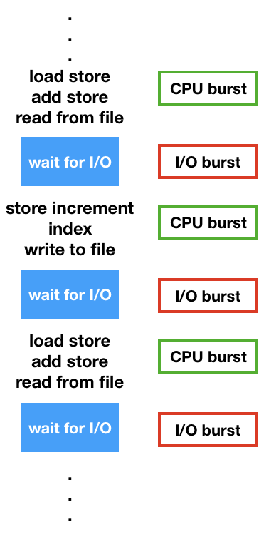
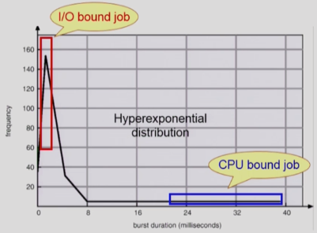
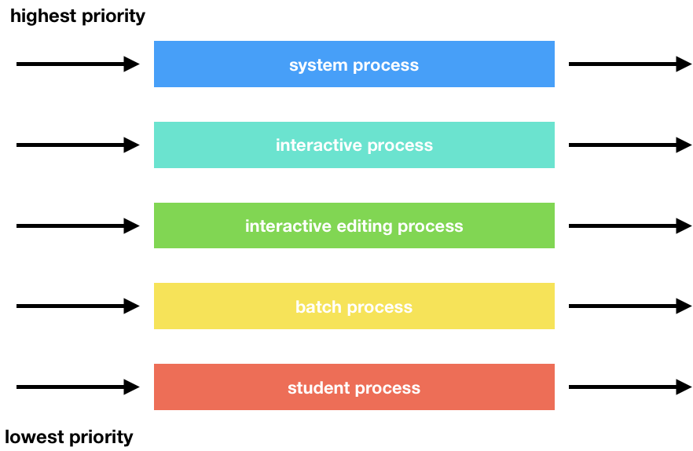
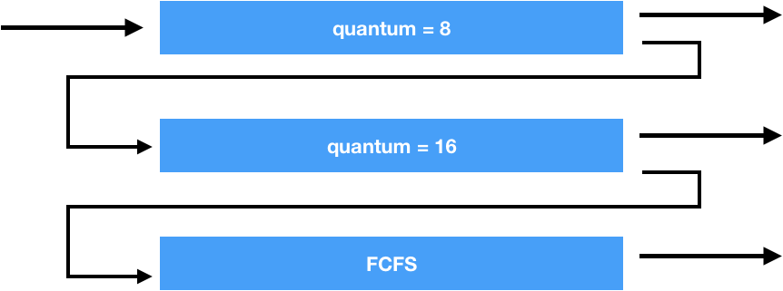

# CPU Scheduling

# 1. Scheduling이 필요한 이유

- **Interactive한 프로그램**의 경우 위와 같이 작동한다. (입력 출력이 많기 때문)
- 공학 계산용은 I/O Burst가 적다. (입력을 잘 안받아서)

- 여러 종류의 **job(process)가 섞여 있기 때문**에 **CPU 스케쥴링이 필요**하다
  - Interactive job에게 **적절한 response 제공**
  - CPU와 I/O 장치 등 **시스템 자원을 골고루 효율적으로 사용**
  - CPU burst가 **짧은 구간** (**I/O 발생** 구간 - `I/O bound job`)
  - CPU burst가 **오랫동안 사용**하는 구간 (`CPU bound job`)
  - **Interactive job에 우선권**을 주는 것이 좋은 것 같다. (사용자와 소통?을 해야 하기 때문)

# 2. 프로세스의 특성 분류

## 2.1. I/O-bound process
- CPU를 잡고 계산하는 시간보다 **I/O에 많은 시간이 필요한 작업**
- **many short CPU bursts**

## 2.2. CPU-bound process
- **계산 위주**의 작업
- **few very long CPU bursts**

# 3. CPU Scheduler & Dispatcher

## CPU Scheduler
- `CPU Scheduler`는 운영체제 안에서 돌아가는 **S/W 코드** 이다.
- **Ready 상태의 프로세스 중**에서 **이번에 CPU를 줄 프로세스를 고른다.**

## Dispatcher
- **CPU의 제어권**을 CPU Scheduler에 의해 **선택된 프로세스에게 넘긴다.**
- `context switch`라 한다.

## CPU Scheduling에 의한 상태 변화
1. `Running -> Blocked` (예: **I/O 요청**하는 시스템 콜)
2. `Running -> Ready` (예: **할당시간 만료**로 **timer interrupt**)
3. `Blocked -> Ready` (예: **I/O 완료후 인터럽트**)
4. `Terminate`

- **1, 4**에서의 스케쥴링은 `nonpreemptive`(**비선점 = 강제로 빼앗지 않고 자진 반납**) 
  - ⭐️CPU를 가지고 있어도 할 수 있는게 없기 때문에 반납
- 다른 스케쥴링은 `preemptive`(**선점형 = 강제로 빼앗음**)이다.

# 4. Scheduling Criteria (성능 척도)

**중국집 주방장의 비유**

## 시스템 입장에서의 성능 척도
- **CPU Utilization (이용률)**
  - **전체 시간** 중 **cpu가 일한 시간의 비율**
  - 내가 고용한 주방장이 놀지 않고 계속 일하는 시간
- **Throughput (처리량)**
  - **주어진 시간**에 **몇개의 작업을 완료**하였는지
  - 단위 시간당 손님이 몇명 밥을 먹을 수 있는지

## 프로그램 입장(사용자)에서의 성능 척도
- **Turnaround time (소요시간, 반환시간)**
  - CPU를 사용하러 들어와서 **작업을 다 끝내고 나간 시간**
  - ⭐️ `waiting time` + `연산 시간`
  - 고객이 밥을 먹으러 와서 다 먹고 나갈 때까지 걸리는 시간
- **Waiting time (대기 시간)**
  - ready queue에 기다린 시간
  - **선점형 스케쥴링**은 CPU를 **얻었다 뺏겼다** 계속 반복하면서 queue에 여러번 들어가는데 이때 **기다리는 모든 시간의 합**을 의미
  - 음식을 기다리는 시간
- **Response time (응답 시간)**
  - ready queue에 들어와서 **처음으로 CPU를 얻기까지 걸린 시간**
  - ⭐️ **최초**의 CPU를 얻는 시간
  - time sharing 환경의 경우 사용자가 처음 반응을 받는 시간이 중요하기 때문에 Response time을 따짐
  - 첫번째 음식이 나올 때까지 걸리는 시간

# 5. Scheduling Algorithms

## 5.1. FCFS(First-Come First-Served)
- **먼저 온 프로세스**에게 CPU를 할당하는 스케쥴링 알고리즘
- 앞에 프로세스에 따라서 Average waiting 영향을 크게 받음.
- **비선점형(Non Preemptive)**

|process|burst time|
|-------|----------|
|P1     |24        |
|P2     |3         |
|P3     |3         |

**프로세스의 도착 순서가 P1, P2, P3일 경우**
- Waiting time for P1 = 0, P2 = 24, P3 = 27
- Average waiting time: (0 + 24 + 27) / 3 = 17

**프로세스의 도착 순서가 P2, P3, P1일 경우**
- Waiting time for P1 = 6, P2 = 0, P3 = 3
- Average waiting time: (6 + 0 + 3) / 3 = 3
- ⭐️ **Convoy effect**: 긴 프로세스들이 앞에 먼저 와서 뒤에 있는 짧은 프로세스들이 영향을 받는 현상

## 5.2. SJF(Shortest-Job-First)
- **CPU burst time이 가장 짧은 프로세스**에게 CPU를 먼저 할당
- 주어진 프로세스들에 대해 ⭐️ **minimum average waiting time** 보장
- Nonpreemptive와 preemptive 두 가지 방법 존재
  - **Nonpreemptive**: CPU를 잡으면 **CPU burst가 완료될 때까지 CPU를 선점 당하지 않음**
  - **Preemptive**: 현재 수행중인 프로세스의 **남은 burst time보다 더 짧은 CPU burst time을 가지는 새로운 프로세스** 도착하면 CPU를 빼앗음 (`SRTF`)
- ⭐️ **Starvation 문제 발생**
- CPU burst time을 알 수 없다. (**추정만 가능** - 과거의 CPU burst time을 이용해서 추청)

**Nonpreemptive SJF**

|process|arrival time|burst time|
|-------|------------|----------|
|P1     |0.0         |7         |
|P2     |2.0         |4         |
|P3     |4.0         |1         |
|P4     |5.0         |4         |

- Average waiting time = (0 + 6 + 3 + 7) / 4 = 4

## 5.3. SRTF(Shortest-Remaining-Time-First)
**Preemptive SJF**

|process|arrival time|burst time|
|-------|------------|----------|
|P1     |0.0         |7         |
|P2     |2.0         |4         |
|P3     |4.0         |1         |
|P4     |5.0         |4         |

- Average waiting time = (9 + 1 + 0 + 2) / 4 = 3

## 5.4. Priority Scheduling
- **우선 순위가 높은 프로세스**에게 CPU 할당
- Nonpreemptive와 Preemptive 두 가지 방법 존재
- **SJF**는 **일종의 Priority Scheduling**이다. (priority = predicted next CPU burst time)
- ⭐️ **Starvation 문제**: 낮은 우선순위를 가진 프로세스는 평생 실행되지 못할 수도 있다.
- ⭐️ **Aging 기법**으로 Starvation 해결: 프로세스의 대기 시간을 카운트 하여 우선순위를 조정

## 5.5. RR (Round Robin)
- 각 프로세스는 **동일한 크기의 할당 시간**(`time quantum`)을 가진다.
- **할당 시간이 지나면** 프로세스는 **선점(preempted)** 당하고 **ready queue**의 제일 뒤에 가서 다시 **대기**한다.
- **응답 시간이 빠르다.**
- **n개의 프로세스**가 **ready queue**에 있고 **할당 시간이 q time unit**인 경우 각 프로세스는 최대 q time unit 단위로 **CPU 시간의 1/n**을 얻는다. (⭐️ **어떤 프로세스도 (n-1)q time unit 이상 기다리지 않는다.**)
- ⭐️ 성능
  - **q large** -> FCFS
  - **q small** -> **context switch 오버헤드가 커진다.**

|process|burst time|
|-------|----------|
|P1     |53        |
|P2     |17        |
|P3     |68        |
|P4     |24        |

q time = 20

- 일반적으로 `SJF`보다 **average turnaround time이 길지만** **response time은 더 짧다.**

## 5.6. Multilevel Queue
- **Ready Queue**를 여러 개로 분할
  - **foreground**(`interactive` job)
  - **background**(`batch` job - no human interaction)
- 각 큐는 독립적인 스케쥴링 알고리즘을 가진다.
  - **foreground** - `Round Robin` - 사람과 interaction을 하는 작업이기 때문
  - **background** - `FCFS` - context switch 오버헤드를 줄이기 위해
- 큐에 대한 스케쥴링이 필요하다.
  - **Fixed priority scheduling**
    - 우선 순위가 높은 `foreground`가 비어있을 때만 background에게 CPU를 할당
    - 🚨 **starvation** 가능성이 있다.
  - **Time slice**
    - 각 큐에 **CPU time을 적절한 비율**로 할당
    - **foreground(Round Robbin)** - 80%, **background(FCFS)** - 20%

## 5.7. Multilevel Feedback Queue
`Multilevel Queue`는 **한번 큐에 들어가면 다른 큐로 이동을 할 수 없다.** (신분 상승의 기회가 없음 ㅜ)

- 프로세스가 **다른 큐로 이동이 가능**하다.
- **에이징**을 이와 같은 방식으로 구현
- Multilevel-feedback-queue scheduler를 정의하는 파라미터들
  - **Queue의 수**
  - 각 Queue의 **scheduling algorithm**
  - **Process를 상위 큐로 보내는 기준**
  - **Process를 하위 큐로 보내는 기준**
  - 프로세스가 CPU 서비스를 받으려 할 때 **들어갈 큐를 결정하는 기준**
- 처음 들어오는 프로세스는 우선 순위가 높은 큐에 넣는다.
  - **할당 시간이 다 되면 아래 큐로 강등** 시킴 (우선순위를 낮춤)
  - 위의 큐가 비어있을 때가지 기다려야 함

### Ex) 3개의 큐
- Q0 - time quantum: 8ms
- Q1 - time quantum: 16ms
- Q2 - FCFS

⭐️ **스케쥴링**
- new Job이 Q0로 들어감
- CPU를 잡아서 8ms 동안 수행
- 8ms 동안 다 끝내지 못하면 Q1으로 내려감
- Q1에 줄서서 기다렸다가 CPU를 잡아서 16ms동안 수행
- 16ms에 끝내지 못한 경우 Q2로 내려감

# 6. Multiple-Processor Shceduling

CPU가 여러 개인 경우 스케쥴링은 더 복잡해진다.

## 6.1. Homogeneous processor인 경우
- **Queue에 한줄로 세워서** 각 프로세서가 **앞에서 꺼내가게 할 수 있다.**
  - 화장실이 여러 칸으로 늘어난 경우와 같다. (한줄 서서 빈 칸에 들어감)
- 반드시 **특정 프로세서에서 수행되어야 하는 프로세스가 있는 경우에는 문제가 더 복잡**해진다.
  - 미용실을 갔는데 특정 선생님한테 머리를 해야해서 기다리는 경우

## 6.2. Load Sharing
- 일부 프로세서에 **job이 몰리지 않도록 부하를 적절히 공유**하는 메커니즘 필요
- **별개의 큐를 두는 방법 vs 공통 큐를 사용하는 방법**
  - = 화장실 칸 앞에서 줄을 서는 것 VS 화장실 입구에서 줄을 서는 것

## 6.3. Symmetric Multiprocessing(SMP)
- 각 프로세서가 **각자 알아서 스케쥴링 결정**

## 6.4. Asymmetric multiprocessing
- **하나의 프로세서가 시스템 데이터의 접근과 공유를 책임**지고 **나머지 프로세서는 거기에 따른다.**

# 7. Real-Time Scheduling

## 7.1. Hard real-time system
- **정해진 시간 안에** 반드시 **끝내도록** 스케쥴링해야 한다.
- `Deadline`을 반드시 보장해야 한다.

## 7.2. Soft real-time computing
- **일반 프로세스에 비해 높은 priority**를 갖도록 해야한다. (deadline을 어느정도 지키려고)
- 영화를 보는 경우 (반드시 deadline을 지킬 필요는 없다.)

# 8. Thread Scheduling

## 8.1. Local Scheduling
- `User level thread`의 경우 **사용자 수준의 thread library**에 의해 **어떤 thread를 스케줄할 지 결정**
- ⭐️ **운영체제는 스레드를 모르기 때문**에 프로세스에 CPU를 줄지 안줄지 결정하고 **스레드는 사용자 프로세스에서 결정**

## 8.2. Global Scheduling
- `Kernel level thread`의 경우 일반 프로세스와 마찬가지로 **커널의 단기 스케줄러**가 **어떤 thread를 스케줄할지 결정**
- **운영체제가 스레드의 존재를 알기 때문**에 **프로세스 스케줄링하듯이 결정**

# 9. Algorithm Evaluation

## 9.1. Queueing models
- **확률 분포**로 주어지는 **arrival rate**와 **service rate** 등을 통해 **performance index** 계산

## 9.2. Implementation(구현) & Measurement(성능 측정)
- **실제 시스템**에 알고리즘을 **구현**하여 실제 작업에 대해서 성능을 **측정** 비교

## 9.3. Simulation(모의 실험)
- 알고리즘을 **모의 프로그램**으로 작성 후 **trace**를 입력으로 하여 결과 비교
