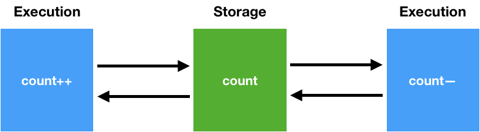
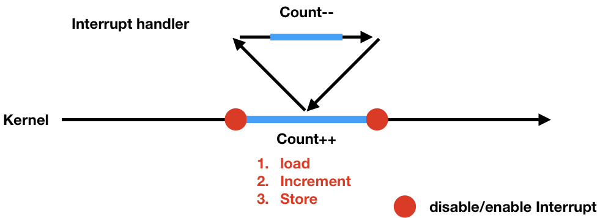
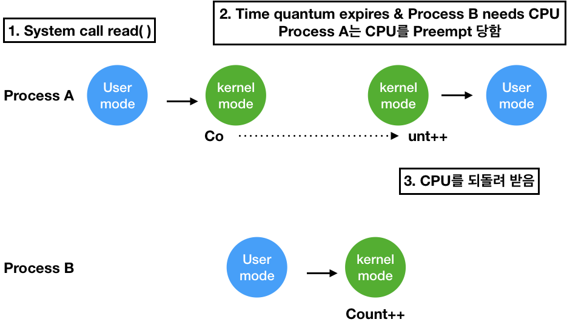
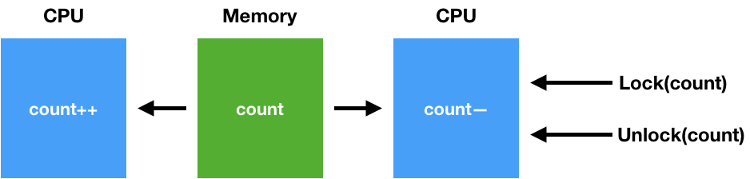
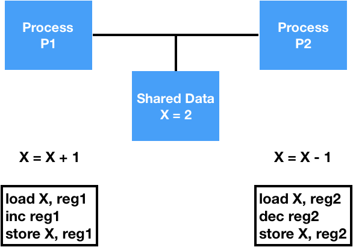
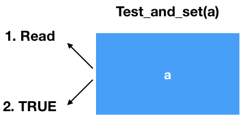
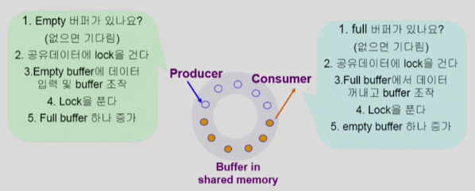
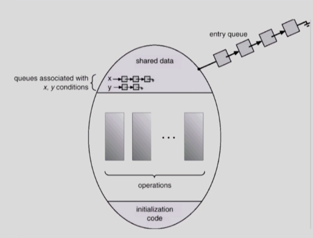

# Process Synchronization

# 1. Race Condition



- Storage Box를 공유하는 Execution Box가 여럿 있는 경우 `Race Condition` 가능성이 있다.
  - **Multiprocessor System**
  - **공유 메모리**를 사용하는 프로세스들
  - **커널 내부 데이터를 접근**하는 루틴 간

### ⭐️⭐️ OS에서 Race Condition이 발생하는 경우
1. **kernel 수행 중 인터럽트 발생 시**
2. **Process가 system call**을 하여 kernel mode로 수행중인데 **context switch 발생**하는 경우
3. **Multiprocessor**에서 **shared memory 내의 kernel data**

## 1.1. OS에서의 Race Condition - 1

**load 완료 후 Increment 수행 하려는 순간 Interrupt handler 발생**


- **커널모드 running** 중 **interrupt가 발생**하여 **인터럽트 처리루틴이 수행**
  - -> ⭐️ 양쪽 다 커널 코드이므로 **kernel address space 공유**

## 1.2. OS에서의 Race Condition - 2


- **두 프로세스의 address space** 간에는 **data sharing이 없다.**
- **system call을 하는 동안**에는 **kernel address space의 data를 share**하게 된다.
- **system call**을 하는 작업 중간에 **CPU를 preempt**하면 **race condition 발생**

### kernel 모드에서 CPU가 Preempt된 경우



**문제점**
- count를 A와 B에서 했기 때문에 2가 증가되길 기대, 하지만 1만 증가한다.
- PA는 Count가 0일 때 상태를 읽어서 증가 시키는 도중에 PB에게 제어권을 빼앗김
- PB도 Count가 0일 때 상태를 읽어서 증가 시킴

**해결책**
- ⭐️ **커널 모드에서 수행** 중일 때는 CPU를 **preempt하지 않는다.**
- 커널 모드에서 **사용자 모드로 돌아갈 때 preempt**

## 1.3. OS에서의 Race Condition - 3



**문제점**
- ⭐️ **Multiprocessor의 경우 interrupt enable/disable로 문제가 해결되지 않는다.**
- interrupt가 걸렸다고 다른 CPU가 데이터를 안읽어 간다는 보장이 없다.

**해결책**
- **한번에 하나의 CPU**만이 커널에 들어갈 수 있도록 하는 방법
- 커널 내부에 있는 각 공유 데이터에 접근할 때마다 그 **데이터에 대한 lock / unlock**을 하는 방법

# 2. Process Synchronization 문제

- `공유 데이터(shared data)`의 `동시 접근(concurrent access)`은 `데이터의 불일치 문제(inconsistency)`를 발생시킬 수 있다.
- **일관성(consistency) 유지**를 위해서 **협력 프로세스 간의 실행 순서**를 정해주는 메커니즘 필요
- **Race Condition**
  - 여러 프로세스들이 **동시에 공유 데이터를 접근**하는 상황
  - 데이터의 **최종 연산 결과**는 **마지막에 그 데이터를 다룬 프로세스에 따라 달라진다.**
  - `race condition`을 막기 위해서는 **concurrent process는 동기화** 되어야 한다.



**P1 수행중 timer interrupt 발생해서 context switch가 일어나서 P2가 CPU를 잡으면 문제 발생**

# 3. Critical Section Problem

- **n개의 프로세스**가 **공유 데이터를 동시에 사용**하기를 원하는 경우
- 각 프로세스의 **code segment**에는 공유 데이터를 접근하는 코드인 **critical section**이 존재
- ⭐️ **하나의 프로세스가 critical section에 있을 때 다른 모든 프로세스는 critical section에 들어갈 수 없어야 한다.**
- ⭐️️⭐️⭐️ `Critical Section`은 Shared Data 메모리 영역이 아닌 **공유 데이터에 접근하는 Code**이다. **(P1의 X = X + 1, P2의 X = X - 1)**

## Initial Attempts to Solve Problem
- 두 개의 프로세스 P0, P1 존재
- 프로세스들은 **수행의 동기화**를 위해 몇몇 **변수를 공유**할 수 있다. (`synchronization variable`)

```c
do {
    entry section
    critical section
    exit section
    remainder section
} while(1);
```

# 4. 프로그램적 해결법의 충족 조건

## 4.1. Mutual Exclutsion (상호 배제)
프로세스 **Pi가 critical section 부분을 수행** 중이면 **다른 모든 프로세드들**은 그들의 **critical section에 들어가면 안된다.**

## 4.2. Progress
**아무도 cirical section에 있지 않은 상태**에서 critical section에 **들어가고자 하는 프로세스가 존재**하면 **cirtical section에 들어갈 수 있도록 해야한다.**

## 4.3. Bounded Waiting (유한 대기)
- critical section에 못들어가고 **너무 오래 기다리는 starvation이 발생하는 일이 없어야 한다.**
- 프로세스가 critical section에 들어가려고 요청한 후부터 그 요청이 허용될 때까지 다른 **프로세스들이 cirtical sectionc에 들어가는 횟수에 한계**가 있어야 한다.
- **세 개의 프로세스**가 critical section에 들어가야 하는데 **2개의 프로세스만 왔다갔다** 하면서 **하나의 프로세스가 starvation**이 생길 때

# 5. 알고리즘

## 5.1. 방법 1
- Synchronization variable
  - int turn
  - initially turn = 0; -> Pi가 critical section에 들어가려면 if(turn == i)이어야 함
- **Mutual Exclusion** 조건 **만족**
- **Progress** 조건 **불만족**
- P0, P1이 존재할 때 **turn을 넘겨 받는 것이 서로에게 의존적**임
- ⭐️ **critical section을 잘 풀어내지 못한 방법**이다.
- ⭐️ P0는 빈번하게 들어가고 싶은데 P1이 한 번만 들어가고 종료되는 경우 P0가 진입을 할 수 없기 때문에 **Progress 불만족**

```c
// P0인 경우
do {
    while (turn != 0) // 자기 차례가 될 때까지 대기
    critical section
    turn = 1; // Now it's your turn
    remainder section
} while(1);
```

## 5.2. 방법 2

- Synchronization variable
  - boolean falg[2];
  - initially flag[모두] = false
- Pi가 critical section에 들어가려면 if(flag[i] == true)이어야 함
- **critical section에 들어가기 전**에 **flag를 check**하고 **상대방의 flag**도 확인하여 **비었을 경우에만 진입**
- ⭐️ **두 프로세스가 동시에 flag를 true로 변경**하는 경우 어느 누구도 **critical section에 진입하지 못하는 문제** 발생

```c
// Pi인 경우
do {
    flag[i] = true; // critical section에 들어감
    while (flag[j]); // 상대방의 flag 확인 (상대방도 들어가려고 하는지)
    critical section
    flag[i] = false; // critical section에 나감
    remainder section
} while(1);
```

## 5.3. 방법 3 (Peterson's Algorithm)
- 방법 1과 방법2를 합친 방법
- 3가지 조건을 모두 만족
- ⭐️ **Busy Waiting** (`Spin Lock` - 계속 while문을 검사): **CPU와 Memory를 사용하면서 wait**

```c
do {
    flag[i] = true;
    turn = j;
    // 상대방이 flag를 가지고 있지만 turn이 아니거나 상대방이 flag가 없고 turn인 경우가 아니면 critical section 진입
    while (flag[j] && turn == j); // 상대방 flag 확인 + 상대방 turn인지 확인
    critical section
    flag[i] = false;
    remainder section
} while(1);
```

## 5.4. 하드웨어적인 방법
- Test & Modifiy를 Atomic하게 수행할 수 있도록 **하드웨어가 지원**하는 경우 간단히 해결 가능
- **하나의 인스트럭션이 변수 값을 읽고 수정할 수 없기 때문**에 위와 같은 일이 일어나는데 이를 **하드웨어적으로 보장**하면 쉽게 해결할 수 있다.



```c
Synchronization variable: boolean lock = false;

Process Pi
do {
    while (Test_and_Set(lock));
    critical section
    lock = false;
    remainder section
}
```

# 6. Semaphores
위 방법을 **추상화** 시킨 것이다.

## Semaphore S
- 정수형 변수
- **두 가지 atmoic 연산**에 의해서만 접근 가능
- `S`는 **자원의 갯수**

### P(S)
- semaphore 값 (`공유 데이터`)을 **획득**하는 과정 (**Lock을 거는 과정**)
- ⭐️ **자원이 없을 때** `busy wating` 문제 존재 (비효율)
```
while (S <= 0) do no-op;
S--;
```

### V(S)
semaphore 값 (`공유 데이터`)을 **반환**하는 과정 (**Lock을 푸는 과정**)
```
S++;
```

## Critical Section of n Processes

```c
Synchronization variable
semaphore mutex; // initially 1: 1개가 CS에 들어갈 수 있다.

Process Pi
do {
    P(mutex);
    critical section
    V(mutex);
    remainder section
} while(1);
```

## Block & Wakeup 방식 (Sleep Lock)
- while을 통한 `busy waiting` 방식은 **비효율**적
- Semaphore를 다음과 같이 정의한다.

```c
typedef struct {
    int value;         // semaphore
    struct process *L; // process wait queue
} semaphore;
```

- block과 wakeup을 다음과 같이 가정
  - **block**
    - 커널은 **block을 호출한 프로세스를 suspend** 시킴
    - 프로세스의 **PCB**를 semaphore에 대한 **wait queue에 넣음**
  - **wakeup(P)**
    - **block된 프로세스 P**를 **wakeup** 시킴
    - 프로세스의 **PCB**를 **ready queue**로 옮김


### Block & Wakeup 구현
`S.value`는 자원의 갯수를 의미하는 것이 아닌 어떤 **프로세스를 깨워야 하는지 상태를 알려주는 값**이다.

**P(S)**: 자원 획득
```c
S.value--; // prepare to enter
if (S.value < 0) { // 자원이 부족한 경우 block
    add this process to S.L;
    block();
}
```

**V(S)**: 자원 반납 + 잠들어 있는 process 깨움
```c
S.value++;
// S.value가 양수인 경우 -> 기다리는 프로세스가 없음 (바로 수행 가능)
// 자원을 내놨는데도 0 이하인 경우 -> 기다리면서 누군가 block되어 있음.
if (S.value <= 0) {
    // 잠들어 있는 프로세스 하나를 queue에서 제거하여 깨움
    remove a process P form S.L;
    wakeup(P);
}
```

## Busy-wait VS Block/Wakeup
- `Critical Section`의 **길이가 긴 경우** `Block/wakeup` 적당
- `Critical Section`의 **길이가 매우 짧은 경우** **Block/Wakeup** 오버헤드가 busy-wait **오버헤드보다 커질 수 있다.**
- 일반적으로는 **Block/Wakeup** 방식이 더 좋다

## 두 가지 타입의 Semaphore

### 1. Counting Semaphore
- **도메인이 0 이상인 임의의 정수** 값
- 주로 `resource counting`에 사용

### 2. Binary Semaphore (mutex)
- **0 또는 1 값**만 가질 수 있는 semaphore
- 주로 `mutual exclusion(lock/unlock)`에 사용

# 7. Deadlock & Starvation

## ⭐️ 7.1. DeadLock
둘 이상의 프로세스가 **서로 상대방에 의해 충족될 수 있는 event**를 **무한히 기다리는 현상**

**S와 Q가 1로 초기화된 Sempahore라고 가정**
|P0   |P1   |설명          |
|-----|-----|-------------|
|P(S);|P(Q);|하나씩 차지     |
|P(Q);|P(S);|상대방 것 요구  |
|...  |...  |             |
|V(S);|(V(Q)|여기와야 relase|
|V(Q);|V(S);|             |

위 문제를 해결하기 위해서는 **자원 획득 순서**를(S를 가져야만 Q를 가질 수 있다.) 정하면 된다.

## ⭐️ 7.2. Starvation
**특정 프로세스들끼리 자원을 독점**해서 **어떤 프로세스가 자원을 획득하지 못하는 현상**

# 8. 고전적인 Synchronization 문제

## 8.1. Bounded-Buffer Problem (Producer-Consumer Problem)

- Producer와 Consumer가 여러개 존재하는 상황
- **Producer**: Buffer에 데이터를 생산하여 넣음 (자원: 비어있는 버퍼의 수)
- **Consumer**: Buffer에서 데이터를 꺼냄 (자원: 차있는 버퍼의 수)
- **Shared Data**: **buffer** 자체 및 buffer 조작 변수
- **Synchronization variables**
  - **mutual exclusion** (binary semaphore): `shared data`의 `mutual exclusion`을 위해
  - **resource count** (integer semaphore): 남은 **full/empty buffer의 수** 표시

### Syncorhonization 문제
- `Producer`가 **동시에 한 버퍼에 데이터를 집어넣는 경우** 문제 발생 (Lock을 건 후 접근 못하게 막아야 함)
- `Consumer`가 **동시에 한 버퍼에서 데이터를 꺼내가는 경우** 문제 발생
- 버퍼가 가득 차거나 비었을 때 Producer, Consumer가 접근할 때 문제가 발생하므로 **자원의 가용 개수를 Counting**해야 한다.



### Code
semaphore full = 0, empty = n, mutex = 1;

**Producer**
```c
do {
    produce an item in x
    ...
    P(empty);
    P(mutex);
    ...
    add x to buffer
    ...
    V(mutex)
    V(full);
} while(1);
```

**Consumer**
```c
do {
    P(full);
    P(mutex);
    ...
    remove an item from buffer to y
    ...
    V(mutex);
    V(empty);
    ...
    consume the item in y
    ...
} while(1);
```

## 8.2. Readers and Writers Problem

- 한 process가 DB에 **write 중**일 때 **다른 process가 접근하면 안된다.**
- `read`는 **동시에 여럿**이서 해도 된다.
- solution
  - `Writer`가 DB에 **접근 허가를 아직 얻지 못한 상태**에서는 모든 대기중인 **Reader들을 다 DB에 접근**하게 해준다.
  - `Writer`는 **대기 중인 Reader가 하나도 없을 때** DB **접근이 허용**된다.
  - `Writer`가 **DB에 접근 중**이면 `Reader`들은 **접근이 금지**된다.
  - `Writer`가 **DB에서 빠져나가야만** `Reader`의 **접근이 허용**된다.
- **Shared Data**
  - **DB 자체**
  - **readcount** -> 현재 DB에 **접근 중인 Reader의 수**
- **Synchronization variables**
  - **mutex**: 공유 변수 **readcount를 접근**하는 코드의 `mutual exclusion` 보장을 위해 사용
  - **db**: Reader와 Writer가 공유 DB 자체를 올바르게 접근하게 하는 역할

### Code

**Shared Data**
int readcount = 0;
DB 자체

**Synchronization variables**
semaphore mutex = 1, db = 1;

**Writer**
```c
P(db);
...
writing DB is performed
...
V(db);
```

**Reader**
```c
P(mutex);
readcount++;
if (readcount == 1) P(db); // block writer
V(mutex); // readers follow
...
reading DB is performed
...
P(mutex);
readcount--;
if (readcount == 0) V(db); // enable writer
V(mutex);
```

- **읽거나 쓰고 있을 때** DB는 **lock**을 걸어야 한다.
- ⭐️⭐️ `Starvation` **발생**이 가능하다.
  - Reader가 계속 요청오는 경우 Writer가 작업을 못하게 된다.

## 8.3. Dining-Philosophers Problem


## Synchronization variables
- semaphore chopstick[5];
- Initially all values are 1

## Code
```c
do {
    P(chopstick[i]);
    P(chopstick[(i + 1) % 5]);
    ...
    eat();
    ...
    V(chopstick[i]);
    V(chopstick[(i + 1) % 5]);
    ...
    think();
    ...
} while(1);
```

### 위 코드의 문제점
- **Deadlock 가능성**이 있다.
  - **모든 철학자가** 동시에 배고파져서 **왼쪽 젓가락을 집어버리는 경우**

### 해결 방안
- **4명의 철학자만이 테이블에 동시에 앉을 수 있도록** 한다.
- 젓가락을 **두 개 모두 집을 수 있을 때에만** 젓가락을 집을 수 있게 한다.
- **비대칭**
  - 짝수(홀수) 철학자는 왼쪽(오른쪽) 젓가락부터 집도록

### 문제를 해결한 코드

```
enum {thinking, hungry, eating} state[5];
semaphore self[5] = 0; // 1인 경우 젓가락 두 개를 다 잡을 수 있는 권한이 있다는 의미
semaphore mutex = 1;

Philosopher i

do {
    pickup(i);
    eat();
    putdown(i);
    think();
} while(1);

void pickup(int i) {
    P(mutex);
    state[i] = hungry;
    test(i);
    V(mutex);
    P(self[i]);
}

void putdown(int i) {
    P(mutex);
    state[i] = thinking;
    test((i + 4) % 5);
    test((i + 1) % 5);
    V(mutex);
}

void test(int i) {
    // 양쪽 철학자 모두 밥을 먹고있지 않고 내가 배고픈 상태이면 젓가락을 집을 수 있다.
    if (state[(i + 4) % 5] != eating &&
        state[(i + 1) % 5 != eating && state[i] == hungry) {
        state[i] = eating;
        V(self[i]);
    }
}
```

# 9. Monitor



- **동시 수행중인 프로세스** 사이에서 `abstract data type`의 **안전한 공유를 보장**하기 위한 `high-level synchronization construct`
- 프로그래머가 **Lock을 별도로 코딩할 필요가 없다.** (동기화 제약 조건을 명시적으로 코딩할 필요가 없다.)
- 모니터 내에서는 **한번에 하나의 프로세스**만이 활동 가능하다.
- **프로세스**가 **모니터 안에서 기다릴 수 있도록** 하기 위해 `conditional variable` 사용
  - condition x, y;
- Condition variable은 `wait`와 `signal`연산에 의해서만 접근이 가능하다
  - **x.wait();**
    - `x.wait()`을 invoke한 프로세스는 다른 프로세스가 `x.signal()`을 **invoke하기 전까지 suspend** 된다.
  - **x.signal();**
    - `x.signal()`은 정확하게 하나의 **suspend된 프로세스를 resume**한다.
    - Suspend된 프로세스가 없으면 아무 일도 일어나지 않는다.

```c
monitor monitor-name {
    shared variable delcations
    
    procedure body P1(...) {
        ...
    }
    procedure body P2(...) {
        ...
    }
    procedure body Pn(...) {
        ...
    }
    {
        initialization code
    }
}
```

## 9.1. Semaphore의 문제점
1. 코딩하기 힘들다.
2. 정확성의 입증이 어렵다.
3. 자발적 협력이 필요하다.
4. 한번의 실수가 모든 시스템에 치명적 영향

## 9.2. 예

**Mutual Exclusion 깨지는 경우**
```c
V(mutex);
Critical Section
P(mutex);
```

**Deadlock 발생하는 경우**
```c
P(mutex);
Critical Section
P(mutex);
```

## 9.2. Bounded-Buffer Problem 모니터 적용

```java
monitor bounded_buffer {
    int buffer[N];
    // condition var은 값을 가지지 않고 자신의 큐에 프로세스를 매달아서
    // sleep 시키거나 큐에서 프로세스를 깨우는 역할만 한다.
    condition full, empty;

    void produce(int x) {
        if (!buffer.empty())
            empty.wait();
        buffer.add(x);
        full.signal();
    }

    void consume(int *x) {
        if (!buffer.full())
            full.wait();
        x = buffer.remove();
        empty.signal();
    }
}
```

## 9.3. Dining Philosophers 모니터 적용

```java
monitor dining_philosopher {
    enum {thinking, hungry, eating} state[5];
    condition self[5];

    void pickup(int i) {
        state[i] = hungry;
        test(i);
        if (state[i] != eating)
            self[i].wait();
    }

    void putdown(int i) {
        state[i] = thinking;
        test((i + 4) % 5);
        test((i + 1) % 5);
    }

    void test(int i) {
        if ((state[(i + 4) % 5] != eating) &&
            (state[(i + 1) % 5] != eating) &&
            (state[i] == hungry)) {
            staet[i] = eating;
            self[i].signal();
        }
    }

    void init() {
        for (int i = 0; i < 5; i++)
            state[i] = thinking;
    }
}

Each Philosopher {
    pickup(i);
    eat();
    putdown();
    think();
} while(1);
```