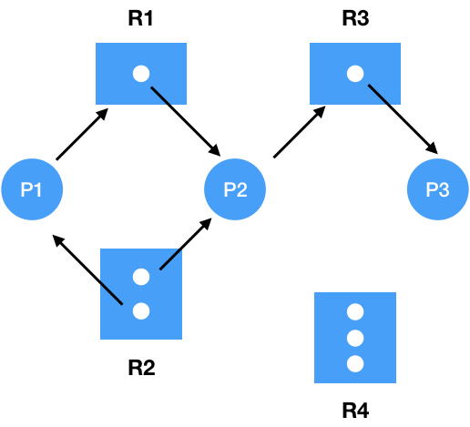
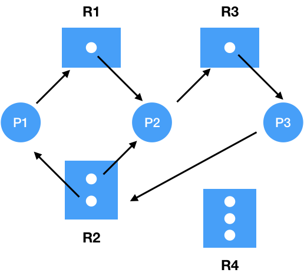
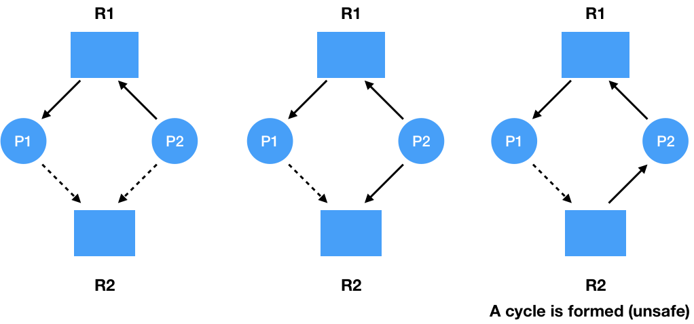
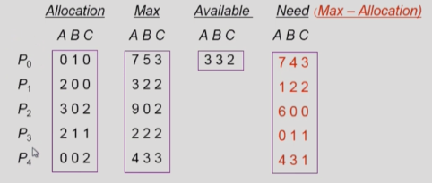
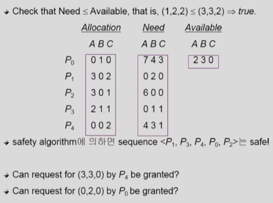
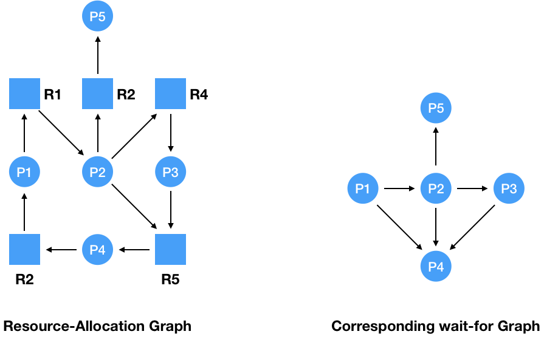
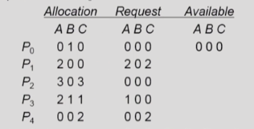

# DeadLock

# 1. DeadLock Problem

## DeadLock
일련의 프로세스들이 **서로가 가진 자원을 기다리며** `block`된 상태

## Resource (자원)
- `하드웨어`, `소프트웨어` 등을 포함하는 개념
- **I/O Device**, **CPU cycle**, **memory space**, **semaphore** 등
- 프로세스가 자원을 사용하는 절차
  - `Request`, `Allocate`, `Use`, `Release`

## DeadLock Example
1. 시스템 2개의 tape drive가 존재하는데 프로세스 P1과 P2 각각이 하나의 tape drive를 보유한 채 다른 하나를 기다리는 상황

2. Binary semaphores A and B

|P0   |P1   |
|-----|-----|
|P(A);|P(B);|
|P(B);|P(A);|

# 2. ⭐️⭐️⭐️️️ DeadLock 발생의 4가지 조건
- **Mutual Exclusion(상호 배재)**
  - 매 순한 **하나의 프로세스만**이 **자원을 사용**할 수 있다.
- **No Preemption(비선점)**
  - 프로세스는 자원을 스스로 내어놓을 뿐 **강제로 빼앗기지 않는다.**
- **Hold and Wait(점유 대기)**
  - 자원을 가진 프로세스가 **다른 자원을 기다릴 때** 보유 자원을 놓지 않고 **계속 가지고 있는다.**
- **Circular Wait(순환 대기)**
  - **자원을 기다리는 프로세스간에 사이클**이 형성되어야 한다.
  - 프로세스 P0, P1, P2, ..., Pn이 존재할 때
    - P0은 P1이 가진 자원을 기다린다.
    - P1은 P2가 가진 자원을 기다린다.
    - Pn-1은 Pn이 가진 자원을 기다린다.
    - Pn은 P0가 가진 자원을 기다린다.

# 3. DeadLock 발생 여부 확인

## 3.1. Resource-Allocation Graph (자원할당 그래프)

- **Vertex**
  - **Process** P = {P1, P2, ..., Pn}
  - **Resource** R = {R1, R2, ..., Rn}
- **Edge**
  - **request** edge Pi -> Rj
  - **assignment** edge Rj -> Pi

⭐️ 위 그림은 **Cycle이 존재하지 않으므로** DeadLock이 아니다.

**DeadLock 발생**

- 그래프에 Cycle이 없으면 DeadLock이 아니다.
- 그래프에 Cycle이 있으면
  - **자원당 instance가 하나**만 존재하면 (사각형 안에 있는 점) `DeadLock`이다.
  - **자원에 instance가 여러개** 존재한다면 **DeadLock 가능성**이 있다.

# 4. DeadLock 처리 방법

- **DeadLock Prevention**
  - 자원 할당 시 DeadLock의 **4가지 필요 조건 중 어느 하나가 만족되지 않도록** 하는 것
- **DeadLock Avoidance**
  - 자원 요청에 대한 부가적인 정보를 이용해서 **DeadLock의 가능성이 없는 경우에만 자원 할당**
  - 시스템 state가 **원래 state로 돌아올 수 있는 경우에만 자원 할당**
- **DeadLock Detection and recovery**
  - DeadLock 발생은 **허용**하되 그에 대한 **detection 루틴을 두어 DeadLock 발견시 Recovery**
- **DeadLock Ignorance**
  - **DeadLock을 시스템이 책임지지 않음**
  - UNIX를 포함한 대부분의 OS가 채택

## 4.1. DeadLock Prevention (가장 강력한 방법)

⭐️ **Utilization 저하**, **throughput 감소**, **starvation** 문제

- **Mutual Exclusion**
  - 공유해서는 안되는 자원의 경우 **반드시 성립**해야 한다. (어떻게 해결할 수 있는 조건이 안된다.)
- **Hold and Wait**
  - 프로세스가 자원을 요청할 때 **다른 어떤 자원도 가지고 있지 않아야 한다.**
  - 자원을 기다리는 상황 -> 자원을 보유하고 있지 않으면 된다.
  - **방법 1**. **프로세스 시작** 시 **모든 필요한 자원을 할당**받게 하는 방법 (자원에 대한 **비효율성** 문제 -> 아직 사용도 안하는데 미리 할당 받겠다고?)
  - **방법 2**. 자원이 필요할 경우 **보유 자원을 모두 놓고 다시 요청**
- **No Preemption** (자원을 중간에 빼앗음)
  - 프로세스가 어떤 자원을 기다려야 하는 경우 이미 보유한 자원이 선점됨
  - 모든 필요한 자원을 얻을 수 있을 때 그 프로세스는 다시 시작된다.
  - `State`를 **쉽게 save**하고 **restore**할 수 있는 자원에서 주로 사용한다. (CPU, Memory)
- **Circular Wait**
  - 모든 자원 유형에 할당 순서를 정하여 **정해진 순서대로만 자원 할당**
  - 예를 들어 1, 3, 5번 자원이 존재하면 1번을 획득해야 3번을 획들할 수 있도록 해야 한다.

## 4.2. DeadLock Avoidance (최악의 상황을 가정)

- 자원 요청에 대한 **부가정보**를 이용해서 **자원 할당이 DeadLock으로 부터 안전(safe)**한지를 동적으로 조사해서 **안전한 경우에만 할당** (⭐️ 최악의 경우도 고려한다. - DeadLock 위험성이 있으면 할당 X)
- 가장 단순하고 일반적인 모델은 프로세스들이 필요로 하는 ⭐️ **각 자원별 최대 사용량을 미리 선언**하도록 하는 방법이다. (**사용할 자원을 미리 알고 있다고 가정**)

### Safe State
- 시스템 내의 프로세스들에 대한 safe sequence가 존재하는 상태

### Safe Sequence
- 프로세스의 sequence<P1, P2, ..., Pn>이 safe하려면 Pi(1 <= i <= n)의 자원 요청이 "가용자원 + 모든 Pj(j < i)의 보유 자원"에 의해 충족되어야 한다.
- 조건을 만족하면 다음 방법으로 모든 프로세스의 수행을 보장한다.
  - Pi의 자원 요청이 즉시 충족될 수 없으면 모든 Pj(j < i)가 종료될 때까지 기다린다.
  - Pi-1이 종료되면 Pi의 자원요청을 만족시켜 수행한다.

- 시스템이 `safe state`에 있으면 -> **No DeadLock**
- 시스템이 `unsafe state`에 있으면 -> ⭐️ **Possibility of DeadLock**
- **DeadLock Avoidance**
  - ⭐️ 시스템이 **unsafe state에 들어가지 않는 것을 보장**
  - 2가지의 경우 avoidance 알고리즘
    - **Single Instance per resource** types
      - **Resource Allocation Graph 알고리즘** 사용
    - **Multiple instances per resource** types
      - **Banker's 알고리즘** 사용

### Resource Allocation Graph 알고리즘 사용

- **Claim Edge**: Pi -> Rj
  - 프로세스 **Pi가 자원 Rj를 미래에 요청**할 수 있음을 뜻한다. (**점선**)
  - 프로세스가 해당 **자원 요청시 request edge**로 변경 (**실선**)
  - Rj가 `release`되면 assignment edge는 다시 **claim edge로 변경**
- **request edge의 assignment edge 변경시** (점선을 포함하여) ⭐️ **cycle이 생기지 않는 경우에만 요청 자원 할당**
- Cycle 생성 여부 조사시 프로세스의 수가 n일 때 `O(n^2)` 시간이 걸린다.

위 그림은 **DeadLock이 발생할 수도 있는 것**이지 꼭 DeadLock은 아니다.

- P1이 R2에게 자원을 요청할 계획이지, 지금 요청을 하지 않았기 때문

### Banker's 알고리즘 사용

굉장히 보수적인 알고리즘이다. (**DeadLock 가능성**이 있으면 **절대로 자원을 할당하지 않는다.**)

- 5개의 프로세스 존재: P0, P1, P2, P3, P4
- 3개의 자원: A(10개), B(5개), C(7개)
- T0에서의 Snapshot

- Available = 전체 instance(10, 5, 7) - Allocation(P0~P4)

Seqeucne <P1, P3, P4, P2, P0>가 존재하므로 시스템은 **safe state**이다.

**P1 request(1, 0, 2)**

## 4.3. DeadLock Detection And Recovery

DeadLock 발생을 허용하지만, **DeadLock 발견시 Revoer**

### DeadLock Detection
- Resource type 당 **single instance**인 경우
  - `자원할당 그래프`에서의 cycle이 곧 DeadLock을 의미한다.
- Resource type 당 **multiple instance**인 경우
  - `Banker's 알고리즘`과 유사한 방법을 사용

### Wait-for graph 알고리즘
- Resource type 당 **single instance**인 경우
- `Wait-for graph`
  - **자원할당 그래프의 변형**
  - **프로세스만으로 node** 구성
  - Pj가 가지고 있는 자원을 Pk가 기다리는 경우 **Pk -> Pj**
- 알고리즘
  - Wait-for graph 사이에 사이클이 존재하는지 주기적으로 조사
  - **O(N^2)**

#### Resource type 당 single instance인 경우

**자원의 최대 사용량을 미리 알릴 필요가 없다 -> 그래프에 점선이 없다**

#### Resource type 당 multiple instance인 경우
- 5개의 프로세스 존재: P0, P1, P2, P3, P4
- 3개의 자원: A(7개), B(2개), C(6개)
- T0에서의 Snapshot
- Request가 없으면 자원은 반납 할 것이라고 판단하고 진행

- No DeadLock: sequence <P0, P2, P3, P1, P4>

**P2가 C를 추가로 요청하는 경우**

- 시스템이 안전한가?
  - P0 완료 후 자원 반납 가능하지만 자원이 충분하지 않다.
  - **DeadLock 존재** -> (P1, P2, P3, P4)

**Request는 추가요청가능량이 아닌 현재 실제로 요청한 자원량을 나타낸다.**

### DeadLock Recovery

- **Process Termination** (프로세스 종료 시키는 방법)
  - DeadLock이 발생한 **모든 프로세스를 중단**
  - DeadLock이 풀릴때까지 **프로세스를 하나씩 중단**
- **Resource Preemption** (DeadLock에 연루된 자원을 뺏는 방법)
  - 비용을 최소화할 victim의 선정
  - safe state로 rollback하여 process를 restart
  - ⭐️ **Starvation 문제**
    - **동일한 프로세스**가 계속해서 **victim으로 선정**되는 경우
    - **cost factor에 rollback 횟수도 같이 고려**해야 한다.

## 4.4 DeadLock Ignorance
- DeadLock이 발생하지 않는다고 생각하고 **아무런 조치도 취하지 않음**
  - DeadLock이 매우 드물게 발생하므로 **DeadLock에 대한 조치 자체가 더 큰 overhead**임
  - 만약 시스템에 DeadLock이 발생한 경우 시스템이 비정상적으로 작동하는 것을 사람이 느낀 후 **직접 프로세스를 죽이는 방법**으로 대처
  - UNIX, Windows 등 대부분의 범용 OS가 채택