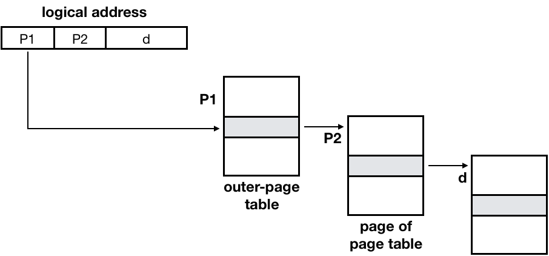
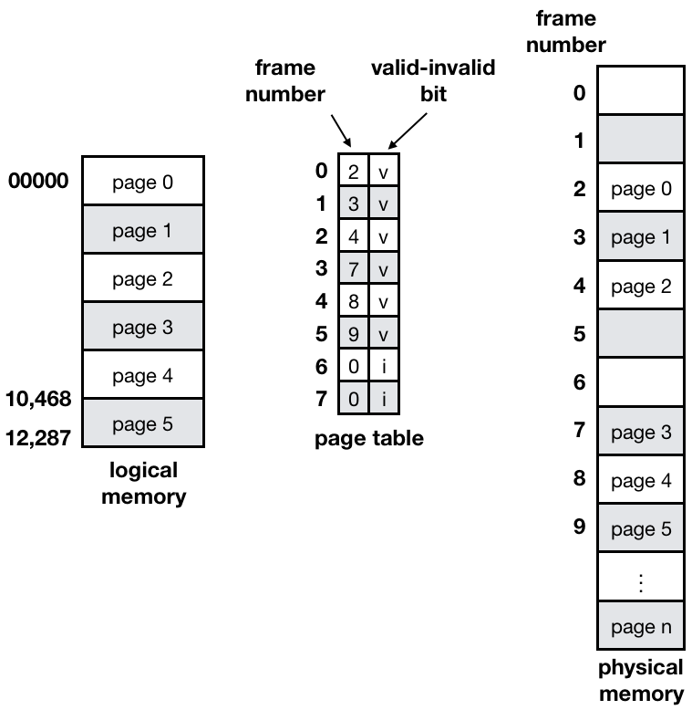

# Memory Management

## 1. Logical vs Physical Address

### Logical Address
- 프로세스마다 **독립적으로 가지는 주소** 공간
- 각 프로세스마다 **0번지부터 시작**
- CPU가 보는 주소는 `Logical Address`

### Physical Address
- 메모리 실제 올라가는 위치

## 2. 주소 바인딩
- 물리적 메모리에 올라갈 주소를 결정하는 것
- Symbolic Address -> Logical Address -> Physical Address

### Compile time binding
- 물리적 메모리 주소가 **컴파일 시** 알려짐
- **시작 위치 변경시 재컴파일**
- 컴파일러는 **절대 코드**(`absolute code`) 생성

### Load time binding
- **Loader**의 책임하에 물리적 메모리 주소 부여
- 컴파일러가 **재배치 가능 코드**(`relocatable code`)를 생성한 경우 가능
- **실행시**에 주소가 결정된다.

### Execution time binding(Run time binding)
- **수행이 시작된 이후**에도 프로세스의 메모리 상 위치를 옮길 수 있다.
- CPU가 **주소를 참조할 때마다** binding을 점검 (address mapping table)
- **하드웨어적인 지원**이 필요하다 (`base and limit registers`, `MMU`)

#### Memory-Management Unit (MMU)
- ⭐️⭐️ **MMU (Memory-Management Unit)**
  - **Logical Address를 Physical Address로 매핑**해주는 Hardware device
- MMU scheme
  - ⭐️ 사용자 프로세스가 CPU에서 수행되며 생성해내는 모든 주소값에 대해 **base register** (=`relocation register`)의 **값을 더한다.**
- **user program**
  - ⭐️ **Logical Address만을 다룬다.**
  - 실제 Physical Address를 볼 수 없으며 알 필요가 없다.

### Dynamic Relocation

### Hardware Support for Address Translation

- 운영체제 및 사용자 프로세스 간의 **메모리 보호를 위해 사용**하는 **레지스터**
- **Relocation register**: 접근할 수 있는 **물리적 메모리 주소의 최소값**
- **Limit Register**: **논리적 주소의 범위**

# 3. 주소 바인딩 기술들

## 3.1. Dynamic Loading
- **프로세스 전체**를 메모리에 **미리 다 올리는 것이 아니라** 해당 ⭐️ **루틴이 불려질 때 메모리에 load**
- **memory utilization 향상**
- **가끔씩 사용되는** 많은 양의 **코드의 경우 유용**하다. (**오류 처리 루틴**)
- 운영체제의 특별한 지원 없이 **프로그램 자체에서 구현 가능**하다 (OS는 라이브러리를 통해 지원 가능)

## 3.2. Overlays (Manual Overlay)
- 메모리에 프로세스의 부분 중 **실제 필요한 정보만을 올린다.**
- **프로세스의 크기가 메모리보다 클 때 유용**하다.
- 운영체제의 지원없이 사용자에 의해 구현한다.
- 작은 공간의 메모리를 사용하던 **초창기 시스템에서 수작업으로 프로그래머가 구현**
- ⭐️⭐️ Dynamic Loading과 차이는 `Dynamic Loading`은 **라이브러리를 통해서 구현**한다.

## 3.3. Swapping
- **Swapping**
  - **프로세스를** 일시적으로 **메모리에서 backing store로 쫓아내는 것**
- **Backing Store (=swap area)**
  - **디스크**
    - 많은 사용자의 프로세스 이미지를 담을 만큼 충분히 빠르고 큰 저장 공간
- `Swap in` / `Swap out`
  - 일반적으로 **중기 스케줄러(swapper)**에 의해 **swap out 시킬 프로세스 선정**
  - **priority-based CPU scheduling algorithm**
    - **priority가 낮은 프로세스**를 `swapped out` 시킨다.
    - **priority가 높은 프로세스**를 **메모리에 올려 놓는다.**
  - **Compile time** 혹은 **load time binding**에서는 **원래 메모리 위치**로 `swap in` 해야 한다.
  - `Execution time binding`에서는 추후 **빈 메모리 영역 아무 곳**에나 올릴 수 있다. (⭐️**효율적으로 사용되려면 Runtime binding이 좋다.**)
  - `Swap Time`은 대부분 **transfer time**이다. (**swap되는 양에 비례**하는 시간)

## Schematic View of Swapping

## 3.4. Dynamic Linking
- Linking을 실행 시간(execution time)까지 미루는 기법
- **Static Linking**
  - **라이브러리가 프로그램의 실행 파일 코드에 포함**됨
  - **실행 파일의 크기가 커짐**
  - 동일한 라이브러리를 각각의 프로세스가 메모리에 올리므로 메모리 낭비 (printf 함수의 라이브러리 코드)
- **Dynamic Linking**
  - **라이브러리가 실행시 연결**된다.
  - 라이브러리 호출 부분에 라이브러리 **루틴의 위치를 찾기 위한 stub이라는 작은 코드를 둔다.**
  - 라이브러리가 이미 메모리에 있으면 그 루틴의 주소를 가고 **없으면 디스크에서 읽어온다.**
  - 운영체제의 도움이 필요하다.

# 4. Allocation of Physical Memory

- 메모리는 일반적으로 두 영역으로 나뉘어 사용한다.
  - **OS 상주 영역**
    - `interrupt vector`와 함께 **낮은 주소 영역** 사용
  - **사용자 프로세스 영역**
    - **높은 주소 영역** 사용
- 사용자 프로세스 영역의 할당 방법
  - `Contiguous allocation`
    - `각각의 프로세스`가 **메모리의 연속적인 공간에 적재**되로록 하는 것
    - **Fixed partition allocation** (메모리 공간을 미리 할당)
    - **Variable partition allocation** (프로그램 순서대로 메모리에 차곡차곡 쌓음)
  - `Noncontiguous allocation`
    - `하나의 프로세스`가 **메모리의 여러 영역에 분산**되어 올라갈 수 있다.
    - **Paging** (같은 크기)
    - **Segmentation** (의미있는 크기)
    - **Paged Segmentation**

## 4.1. Contiguous Allocation
- **고정분할(Fixed partition) 방식**
  - 물리적 메모리를 몇 개의 **영구적 분할**로 나눔
  - 분할의 **크기가 모두 동일한 방식**과 **서로 다른 방식**이 존재
  - 분할당 **하나의 프로그램 적재**
  - 융통성이 없다.
    - 동시에 메모리에 **load되는 프로그램의 수가 고정**된다.
    - 최대 수행 가능 프로그램 크기 제한
  - ️⭐️ `Internal fragmentation` 발생 (`external fragmentation`도 발생)
- **가변분할(Variable partition) 방식**
  - 프로그램의 크기를 고려해서 할당
  - **분할의 크기**, **개수**가 **동적으로 변한다.**
  - ️⭐️ `External fragmentation` 발생

### ️⭐️️⭐️External Fragmentation (외부 조각)
- 프로그램 크기보다 ️⭐️**분할의 크키가 작은 경우**
- 아무 프로그램에도 배정되지 않은 빈 곳인데도 **프로그램이 올라갈 수 없는 작은 분할**

### ️⭐️️⭐️Internal Fragmentation (내부 조각)
- 프로그램 크기보다 ️⭐️**분할의 크기가 큰 경우**
- **하나의 분할 내부에서 발생하는 사용되지 않는 메모리 조각**
- 특정 프로그램에 배정되었지만 **사용되지 않는 공간**

### Hole
- **가용 메모리 공간**
- **다양한 크기의 hole**들이 메모리 여러 곳에 흩어져 있다.
- 프로세스가 도착하면 **수용가능한 hole을 할당**
- 운영체제는 할당 공간, 가용 공간 (hole)의 정보를 유지한다.

### Dynamic Storage-Allocation Problem
`가변 분할 방식`에서 **size n**인 요청을 만족하는 **가장 적절한 hole을 찾는 문제**

- **First-fit**
  - Size가 n 이상인 것 중 **최초로 찾아지는 hole**에 할당
- **Best-fit**
  - Size가 n 이상인 **가장 작은 hole**을 찾아서 할당
  - Hole들의 리스트가 **크기순으로 정렬되지 않은 경우** **모든 hole의 리스트를 탐색**해야 한다.
  - **많은 수의 아주 작은 hole들이 생성**된다.
- **Worst-fit**
  - **가장 큰 hole**에 할당
  - 모든 리스트를 탐색해야 한다.
  - 상대적으로 **아주 큰 hole들이 생성**된다.

`First-fit`과 `best-fit`이 worst-fit보다 **속도와 공간 이용률 측면에서 효과적**이다.

### Compaction
- `External fragmentation` **문제를 해결**하는 한 가지 방법
- **사용 중인 메모리 영역을 한군데로 몰고 hole들을 다른 한 곳으로 몰아 큰 block을 만드는 것**
- **매우 비용이 많이 드는 방법**이다.
- **최소한의 메모리 이동**으로 compaction하는 방법(매우 복잡한 문제)이 좋다. (당연하지 않나..?)
- Compaction은 **프로세스의 주소가 실행 시간에 동적으로 재배치 가능한 경우(Runtime binding)**에만 수행될 수 있다.

## 4.2. Noncontiguous Allocation

### Paging
- 프로세스의 `virtual memory`를 **동일한 사이즈**의 `page` 단위로 나눔
- `Virtual Memory`의 내용이 **page 단위**로 `noncontiguous`하게 저장
- **일부는 backing storage**, **일부는 physical memory**에 저장
- **간단한 방법**
  - `Physical memory`를 **동일한 크기**의 `frame`으로 나눔
  - `Logical memory`를 **동일 크기**의 `page`로 나눔 (⭐️ **frame과 같은 크기**)
  - 모든 **가용 frame들을 관리**
  - `page table`을 사용하여 logical address를 **physical address로 변환**
  - ️⭐️ `External fragmentation` **발생 안함** (같은 크기로 잘라서)
  - ⭐ `Internal fragmentation` **발생 가능** (⭐️ **page 단위로 자르다보면 나머지 자투리가 생길 수 있기 때문** -> 영향력이 크지는 않다)

- **p**: 논리적인 페이지 번호
- **d**: offset
- **f**: frame 번호

### Implemantation of Page Table
- page table은 **main memory**에 상주
- `Page-table base register`(`PTBR`- 페이지 테이블의 시작 위치)가 **page table을 가리킴**
- `Page-table length register`(`PTLR` - 페이지 테이블의 limit 값)가 **테이블 크기를 보관**
- 모든 메모리 접근 연산에는 **2번의 memory access** 필요
- **page table 접근 1번**, 실제 **data/instruction 접근 1번**
- 속도 향상을 위해
  - `associative register` 혹은 `translation look-aside buffer(TLB)`라 불리는 고속의 **lookup hardware cache 사용**

### Associative Register
- **Associative Register(TLB)**: **parallel search** 가능
- TLB에는 page table 중 **일부만 존재**
- **Address Translation**
  - `page table` 중 **일부가 associative register에 보관**되어 있다.
  - `page #`가 **associative register에 있는 경우** 바로 **frame #를 얻음**
  - 그렇지 않는 경우 **main memory에 있는 page table로부터 frame #를 얻음**
  - TLB는 `context switch` 때 `flush` 된다. (**remove old entries**)

## 4.3. Two-Level Page Table
- 현재 컴퓨터는 address space가 매우 큰 프로그램 지원
- **32 bit address** 사용시: **2^32(4G)** 주소 공간
  - `page size`가 **4K**시 **1M page table entry** 필요 (4GB / 4KB = 1M개) -> 각 **프로그램마다 page table entry가 존재**하는데 이를 **각각 만들면 낭비**
  - 각 `page entry`가 1M개의 entry -> 약 **4Byte**시 프로세스당 **4M의 page table** 필요
  - 하지만 대부분의 프로그램은 4G의 주소 공간 중 지극히 일부만 사용하므로 **page table 공간이 낭비**된다. -> ⭐️⭐️ logical memory에 page는 **일부분만 사용**된다. 하지만 **logical memory에 page 번호에 맞게 entry를 채워햐 하므로 (logical 크기 만큼 생성해야 함)** 중간중간 비는 현상이 생기게 된다. (공간낭비)
- **page table 자체를 page로 구성**
- ⭐️⭐️ 사용되지 않는 주소 공간에 대한 **outer page table의 엔트리 값은 NULL** (**대응하는 inner page table은 만들지 않는다.**)

- `logical address`(**32-bit** machine with **4K Page size**)의 구성
  - **20bit**의 `page number`
  - **12bit**의 `page offset`
- page table 자체가 page로 구성되기 때문에 page number는 다음과 같이 나뉜다. (각 page table entry가 4B)
  - **10bit**의 `page number`
  - **10bit**의 `page offset`
- ⭐️⭐️ **안쪽 page table의 크기**가 **memory의 크기**와 같다 (=**4KB**)

**logical address는 다음과 같다**

- **page 하나의 크기가 4KB** -> 2^12 = **12bit** 필요 (페이지 내에서 **offset 구분**)
- **entry 수는 1K**개이다. -> 2^10 = **10bit** 필요

**2단계 페이징에서의 Address-translation scheme**

## 4.4. Multilevel Paging and Performance

- **Address space가 더 커지면** `다단계 페이지 테이블` 필요
- 각 단계의 **페이지 테이블이 메모리에 존재**하므로 `logical address`의 **physical address 변환**에 더 많은 메모리 접근 필요
- `TLB`를 통해 메모리 접근 시간을 줄일 수 있다.
- 4단계 페이지 테이블을 사용하는 경우
  - 메모리 접근 시간이 100ns, TLB 접근 시간이 20ns이고
  - TLB hit ration가 98%인 경우
    - effective memory access time = 0.98 X 120 + 0.02 X 520 = 128ns
    - 결과적으로 주소 변환을 위해 28ns만 소요

### Valid / Invalid Bit in a Page tabel

- 0번 페이지가 2번 frame에 올라와 있다는 의미
- Page 6, Page 7은 사용하지 않지만 **page table entry에 존재**한다.
  - **Program의 maximum 주소 공간**만큼 **entry**가 생겨야 한다. (Table 자료구조 특성상 index로 접근을 하기 때문)
  - 사용하지 않기 때문에 **invalid**로 표시

### Memory Protection
- `Protection bit`
  - page에 대한 **접근 권한** (**read**/**write**/**read-only**)
  - code, data, stack 영역에서 **code 영역**의 경우는 변하면 안되므로 **read-only**로 줘야 한다.
- `Valid-invalid bit`
  - **valid**: 해당 주소의 `frame`에 그 **프로세스를 구성하는 유요한 내용이 있음**을 뜻함 (접근 허용)
  - **invalid**: 해당 주소의 `frame`에 **유용한 내용이 없음**을 뜻함 (접근 불허)
    - 프로세스가 그 **주소 부분을 사용하지 않는 경우**
    - 해당 페이지가 메모리에 올라와 있지 않고 **swap area에 있는 경우**

## 4.5. Inverted Page Table

- **Page Table이 매우 큰 이유**
  - 모든 process 별로 그 **logical address에 대응하는 모든 page에 대해 page table entry가 존재**한다.
  - 대응하는 page가 메모리에 있든 아니든 간에 **page table에는 entry로 존재**한다.
- ⭐️⭐️ **Inverted Page Table**
  - **Page Frame 하나당** page table에 **하나의 entry**를 두는 것 (시스템 전체에 **딱 한개의 page table**만 존재한다.)
  - 각 `page table entry`는 각각의 **물리적 메모리의 page frame이 담고 있는 내용을 표시**한다. (**process-id**, process의 **logical address**)
  - 단점
    - ⭐️ **테이블 전체를 탐색**해야 한다.
    - **associative register를 사용**해서 해결 (parallel하게)

## 4.6. Shared Page

- **Shared Code**
  - **Re-entrant Code = (Pure Code)**
  - **read-only**로 하여 **프로세스 간에 하나의 code만** 메모리에 올린다. (compilers, editor, window system)
  - `Shared code`는 모든 프로세스의 ⭐️ **logical address space에서 동일한 위치**에 있어야 한다.
- **Private code and data**
  - 각 프로세스들은 **독자적으로 메모리에 올린다.**
  - `Private data`는 **logical address space의 아무 곳**에 와도 된다.

Editor 프로그램 3개를 돌릴 때 Editor의 **code 부분**은 변하지 않으므로 **서로 공유**한다.

# 5. Segmentation

- 프로세스를 구성하는 **주소 공간을 의미있는 단위**로 자른 것 (**code**, **data**, **stack**)
  - 작게는 프로그램을 구성하는 **함수 하나하나를 세그먼트**로 정의
  - 크게는 **프로그램 전체를 하나의 세그먼트**로 정의 가능
  - ⭐️ **일반적으로는 code, data, stack** 부분이 하나의 세그먼트로 정의
- `Segment`는 다음과 같은 **logical unit** 들이다.
  - main()
  - function
  - global variables
  - stack
  - symbol table, arrays

## 5.1. Semgmentation Architecture
- Logical Address는 `Segment-number`, `Offset`으로 구성
- **Segment Table**
  - 각 테이블 entry
    - **base**: segment의 **물리적인 주소 시작점**
    - **limit**: **세그먼트의 길이**
- **Segment-Table Base Register** (`STBR`)
  - 물리적 메모리에서의 **segment table 위치**
- **Segment-Table Length Register** (`STLR`)
  - 프로그램이 사용하는 **segment의 수**
    - segment number is legal if s < STLR
- ⭐️ **Segment의 크기가 균일하지 않기 때문**에 **External Fragmentation** 발생
- **Protection**
  - 각 Segment 별로 **protection bit** 존재
    - Valid bit 0 -> **illegal segment**
    - **Read/Write/Execution** 권한 bit
- **Sharing**
  - **Shared segment**
  - **Same Segment Number**
    - segment는 **의미 단위**이기 때문에 **공유**와 **보안**에 있어 paging보다 효과적이다.

**0번 Segment 공유**

# 6. Segmentation with Paging (Paged Segmentation)

- ⭐️ **Pure Segmentation과 차이점**
  - `segement-table-entry`가 segment의 **base address를 가지고 있는 것이 아니라** segment를 구성하는 `page table`의 **base address를 가지고 있다.**
- **물리적 메모리**에 올라갈 때 **page 단위**로 올라간다. (external segementation 해결)
- **segment당 page table** 존재 (이전에는 프로그램당 page table 존재)
- 의미적 단위는 segment로 사용

