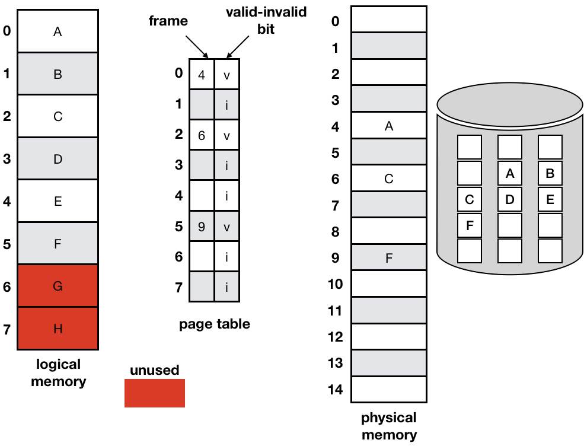
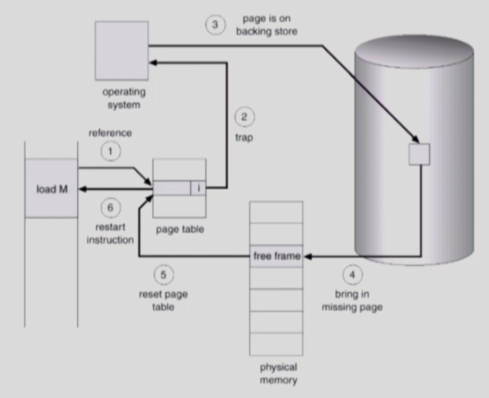
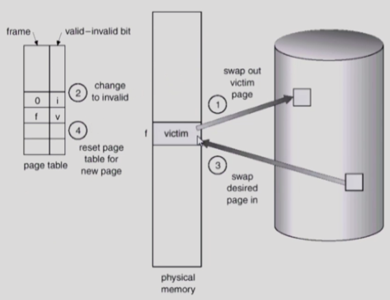
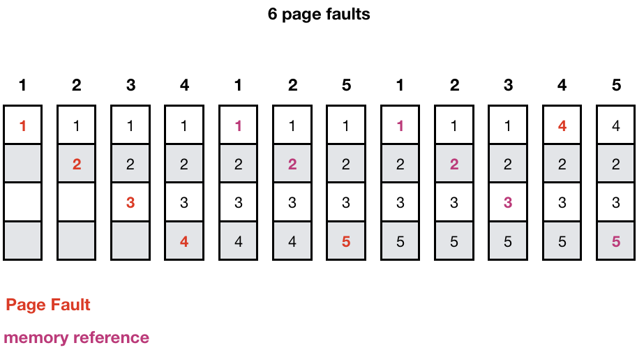
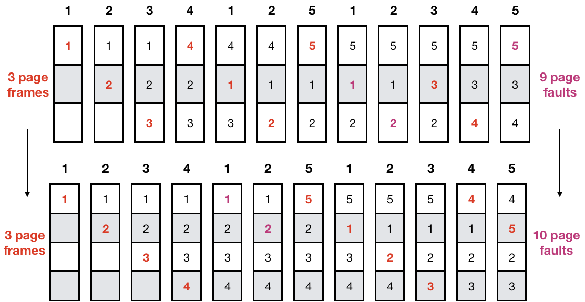
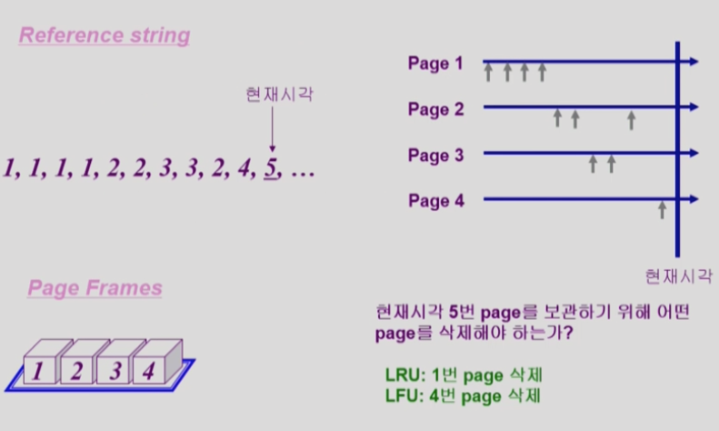
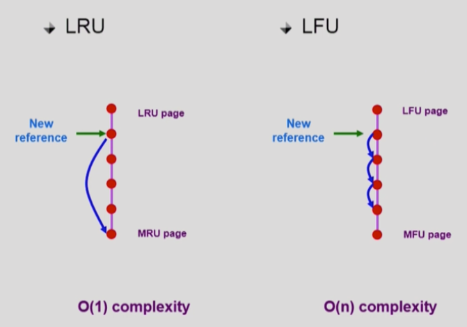
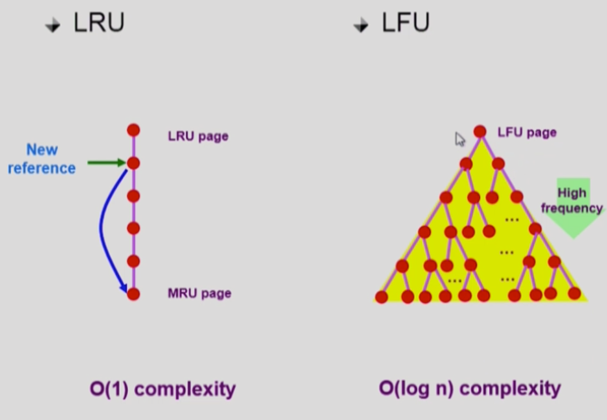
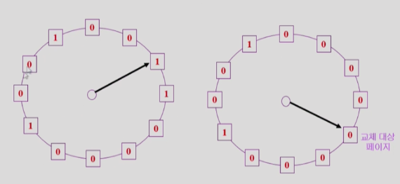

# Virtual Memory

## 1. Demand Paging

- **실제로 필요할 때 page를 메모리에 올리는 것**
  - I/O 양의 감소
  - Memory 사용량 감소
  - 빠른 응답 시간
  - 더 많은 사용자 수용
- **Valid/Invalid bit**의 사용
  - Invalid의 의미
    - **사용되지 않는 주소의 영역**
    - **페이지가 물리적 메모리에 없는 경우**
  - 처음에는 모든 page entry가 invalid로 초기화
  - **address translation 시**에 **invalid bit**이 set되어 있으면 ⭐️ `Page fault`
- Page Fault 발생 시 CPU가 OS로 넘어간다.

### Memory에 없는 Page의 Page Table

## 2. Page Fault
- invalid page를 접근하면 **MMU가 trap을 발생**시킨다. (**page fault trap**)
- **Kernel mode**로 들어가서 **page fault handler가 invoke**된다.
- 다음과 같은 순서로 page fault를 처리한다.
  - **Invalid reference**? (bad address, protection violation) -> **abort process**
  - **Get an empty page frame** (없으면 뺏어온다: replace)
  - **해당 페이지를 disk에서 memory로 읽어온다.** (느린 작업)
    - disk I/O가 끝나기까지 이 프로세스는 **CPU를 preempt** 당한다. (block)
    - **Disk read가 끝나면 page tables entry 기록**, **valid/invalid bit = "valid"**
    - **ready queue에 process를 insert** -> **dispatch later**
  - 이 프로세스가 CPU를 잡고 다시 running
  - 아까 중단되었던 **instruction을 재개**

### Free frame
- **Page replacement**
  - **어떤 frame을 빼앗아올지 결정**해야 함
  - **곧바로 사용되지 않을 page**를 쫓아내는 것이 좋다.
  - **동일한 페이지가 여러 번 메모리에서 쫓겨났다가 다시 들어올 수 있다.**
- **Replacement Algorithm**
  - **page-fault rate을 최소화**하는 것이 목표
  - 알고리즘 평가
    - 주어진 page reference string에 대해 **page fault를 얼마나 내는지 조사**
  - reference string의 예
    - 1, 2, 3, 4, 1, 2, 5, 1, 2, 3, 4, 5

### Page Replacement

- Page Replacement가 발생할 때 Page의 내용이 변경되면 내용 변경 후 Disk로 쫓아냄
- 변경된 내용이 없다면 physical memory에서 지우기만 함

## ⭐️⭐️ 3. Page 교체 알고리즘

### 3.1. Optimal Algorithm
- MIN(OPT): **가장 먼 미래에 참조되는 page를 replace** (`Offline algorithm` - 미래에 참조 될 page를 미리 아는 경우)
  - **Page Fault가 가장 작은** 알고리즘.
- 다른 알고리즘의 성능에 대한 **upper bound 제공**
  - Belady's optimal algorithm, MIN, OPT 등으로 불림.
- 4 frames example

### 3.2. FIFO Algorithm
- 먼저 들어온 것을 먼저 내쫓음
- more frames -> more page faults

### 3.3. LRU (Least Recently Used) Algorithm
- **LRU**: 가장 오래 전에 참조된 것을 지움

### 3.4. LFU (Least Frequently Used) Algorithm
- **LFU**: **참조 횟수가 가장 적은 페이지** 지움
  - 최저 참조 횟수인 **page가 여럿** 있는 경우
    - LFU 알고리즘 자체에서는 **여러 page 중 임의로 선정**
    - 성능 향상을 위해 **가장 오래 전에 참조된 page를 지우게 구현**할 수 있다.
  - **장단점**
    - LRU처럼 직전 참조 시점만 보는 것이 아니라 **장기적인 시간 규모를 보기 때문에 page의 인기도를 좀 더 정확히 반영**할 수 있다.
    - 참조 시점의 최근성을 반영하지 못한다.
    - LRU보다 구현이 복잡

### 3.5. LRU와 LFU 알고리즘 구현

**Heap을 사용하여 비교 횟수 절감**

## 4. 다양한 캐슁 환경

- **캐슁 기법**
  - 한정된 빠른 공간(캐쉬)에 요청된 **데이터를 저장해 두었다가 후속 요청시 캐쉬로부터 직접 서비스**하는 방식
  - paging system 외에도 **cache memory**, **buffer caching**, **Web caching** 등 다양한 분야에서 사용
- **캐쉬 운영의 시간 제약**
  - 교체 알고리즘에서 **삭제할 항목을 결정하는 일에 지나치게 많은 시간이 걸리는 경우** 실제 시스템에서 **사용할 수 없다.**
  - Buffer caching이나 Web caching의 경우
    - O(1)에서 O(log n)정도까지 허용
  - Paging System인 경우
    - **page fault인 경우에만 OS가 관여**
    - 페이지가 **이미 메모리에 존재**하는 경우(⭐️ OS에게 CPU가 넘어가지 않기 때문에 접근 시간을 알 수 없다.) ⭐️ **참조시각 등의 정보를 OS가 알 수 없다.**
    - O(1)인 LRU의 list 조작조차 불가능

### 4.1. Clock Algorithm
- ⭐️ OS는 Page의 시간을 알 수 없기 때문에 LRU, LFU를 사용할 수 없다.
- **Clock Algorithm**
  - **LRU의 근사** 알고리즘
  - 여러 명칭으로 불린다.
    - `Second Chance Algorithm`
    - `NUR` (Not Used Recently)또는 `NRU` (Not Recently Used)
  - `Reference bit`을 사용해서 **교체 대상 페이지 선정** (circular list)
  - **Reference bit가 0**인 것을 찾을 때까지 **포인터를 하나씩 앞으로 이동**
  - 포인터 이동하는 중에 **reference bit 1은 모두 0으로 바꿈**
  - Reference bit이 **0인 것을 찾으면 그 페이지를 교체**
  - **한 바퀴 되돌아와서도(=second change)0이면 그때는 replace**
  - **자주 사용되는 페이지라면 second chance가 올 때 1**
- **Clock Algorithm 개선**
  - `reference bit`과 `modified bit`(dirty bit)을 함께 사용
  - `reference bit = 1` : **최근에 참조된 페이지**
  - `modified bit = 1` : **최근에 변경된 페이지** (I/O를 동반하는 페이지)

- Reference bit = 0 : 한바퀴 도는 동안 참조가 없음
- Reference bit = 1 : 한바퀴 도는 동안 참조가 있음

# 5. Page Frame의 Allocation
- **Allocation problem**: 각 **process에 얼마만큼의 page frame을 할당**할 것인가?
- **Allocation의 필요성**
  - 메모리 참조 명령어 수행시 **명령어**, **데이터** 등 **여러 페이지 동시 참조**
    - 명령어 수행을 위해 **최소한 할당되어야 하는 frame의 수**가 있다.
  - **Loop를 구성하는 page**들은 **한꺼번에 allocate**되는 것이 유리하다.
    - ⭐️⭐️ 만약 for문을 도는 page 3개가 존재하면 3개가 동시에 할당되어야 page fault가 발생하지 않고 잘 돌아갈 것이다.
    - **최소한의 allocation이 없으면** 매 **loop 마다 page fault**
- **Allocation Scheme**
  - `Equal Allocation`: **모든 프로세스에 똑같은 갯수** 할당
  - `Proportional Allocation`: **프로세스 크기에 비례**하여 할당
  - `Priority Allocation`: 프로세스의 **priority에 따라** 다르게 할당

## Global vs Local Replacement

### Global Replacement
- Replace 시 **다른 process에 할당된 frame을 빼앗아 올 수 있다.**
- **Process별 할당량을 조절**하는 또 다른 방법이다.
- `FIFO`, `LRU`, `LFU` 등의 알고리즘을 **global replacement로 사용시에 할당**
- `Working set`, `PFF` 알고리즘 사용

### Local Replacement
- 자신에게 **할당된 frame 내에서만** replacement
- `FIFO`, `LRU`, `LFU` 등의 알고리즘을 **process 별로 운영시**

## ️⭐️️⭐️️⭐️ 6. Thrashing

- ⭐️⭐️ **프로세스의 원활한 수행에 필요한** 최소한의 **page frame 수를 할당 받지 못한 경우**
- ⭐️️️⭐️️⭐️️**Page fault rate이 매우 높아진다.**
- **CPU utilization이 낮아진다.**
- OS는 MPD (Multiprogramming degree)를 (메모리를) 높여야 한다고 판단
- 또 다른 프로세스가 시스템에 추가됨 (higher MPD)
- **프로세스** 당 **할당된 frame의 수가 더욱 감소**
- 프로세스는 **page의 swap in / swap out으로 매우 바쁘다.**
- 대부분의 시간에 **CPU는 한가** (I/O하는 시간이 많기 때문)하다.
- **low throughput**

## 7. Thrashing 해결 방법

### 7.1. Working Set Model
- ⭐️ **Locality of reference**
  - 프로세스는 **특정 시간 동안 일정 장소만을 집중적으로 참조**한다.
  - **집중적으로 참조되는** 해당 **page들의 집합**을 `locality set`이라 한다.
- **Working-set Model**
  - Locality에 기반하여 프로세스가 일정 시간 동안 원활하게 수행되기 위해 **한꺼번에 메모리에 올라와 있어야 하는 page들의 집합**을 `Working Set`이라 정의한다.
  - ⭐️⭐️ Working Set 모델에서는 **process의 working set 전체가 메모리에 올라와 있어야 수행**되고 그렇지 않을 경우 **모든 frame을 반납한 후 swap out (suspend)**
  - **Thrashing을 방지**
  - Multiprogramming degree를 결정
- Working set 결정
  - Working set window를 통해 알아낸다.
  - Window Size가 △인 경우
    - 시각 ti에서의 working set WS(ti)
      - Time interval [ti-△ , ti] 사이에 참조된 서로 다른 페이지들의 집합
    - ⭐️ **Working set에 속한 page는 메모리에 유지, 속하지 않은 것은 버린다.**
- ⭐️⭐️ **Working-Set Algorithm**
  - Process들의 **working set size의 합**이 **page frame의 수보다 큰 경우**
    - **일부 process를 swap out**시켜 **남은 process의 working set을 우선적으로 충족**시킨다.
  - Working set을 다 할당하고도 **page frame이 남는 경우**
    - **Swap out 되었던 프로세스에게 working set을 할당** (MPD를 키움)
- Window Size △
  - Working set을 제대로 탐지하기 위해서는 window size를 잘 결정해야 한다.
  - △ 값이 너무 작으면 locality set을 모두 수용하지 못할 우려가 있다.
  - △ 값이 너무 크면 여러 규모의 locality set 수용
  - △ 값이 무한이면 전체 프로그램을 구성하는 page를 working set으로 간주한다.

### 7.2. PFF(Page-Fault Frequence) Scheme

- Page fault rate의 상한값과 하한값을 둔다.
  - **Page fault rate이 상한값**을 넘으면 **frame을 더 할당**한다.
  - **Page fault rate이 하한값** 이하이면 할당 **frame 수를 줄인다.**
- 빈 frame이 없으면 **일부 프로세스를 swap out**

## ⭐️⭐️ 8. Page Size의 결정

- Page size를 **감소**시키면
  - **페이지 수 증가** (같은 크기의 메모리에서 잘게 썰리기 때문)
  - **페이지 테이블 크기 증가** (Page Entry 수만큼 필요하기 때문)
  - **Internal Fragmentation 감소**
  - **Disk Transfer 효율성 감소**
    - Seek/Rotation vs Transfer
  - **필요한 정보만 메모리에 올라와** 메모리 이용이 효율적
    - Locality의 활용 측면에서는 좋지 않다.
- Trend
  - Larger Page size